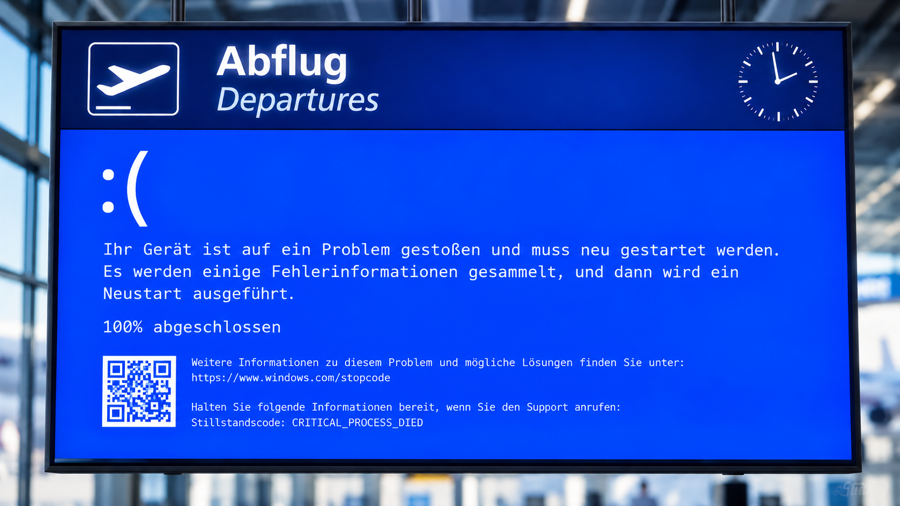
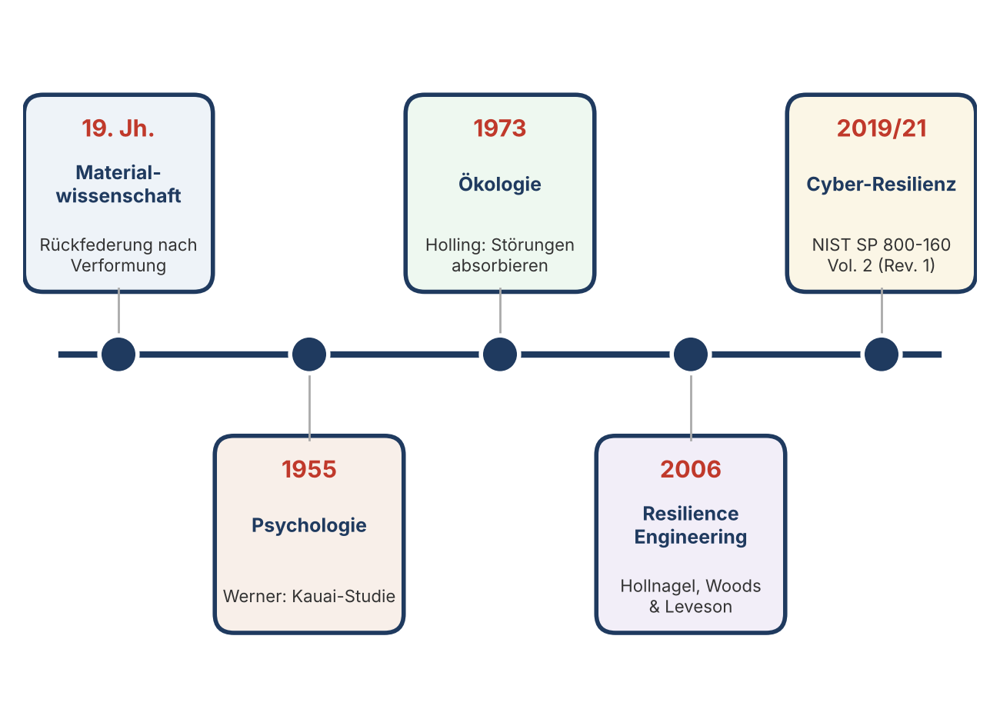
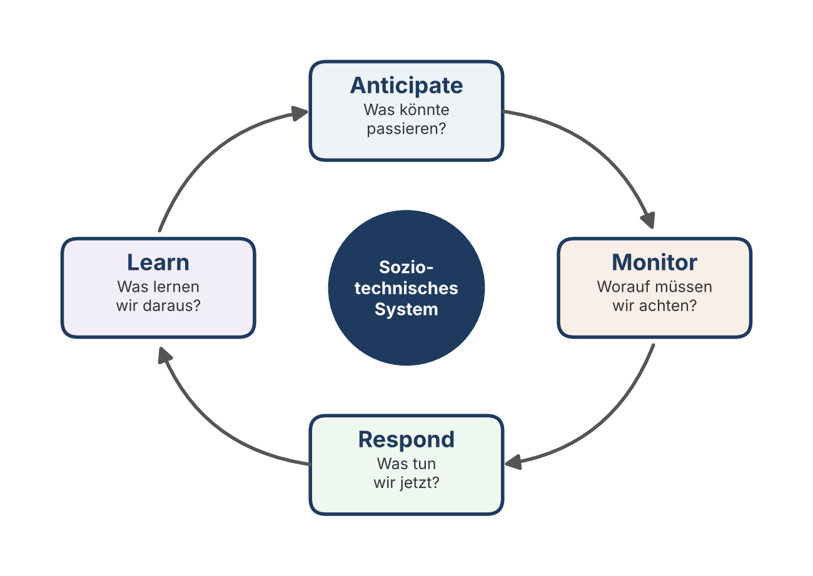
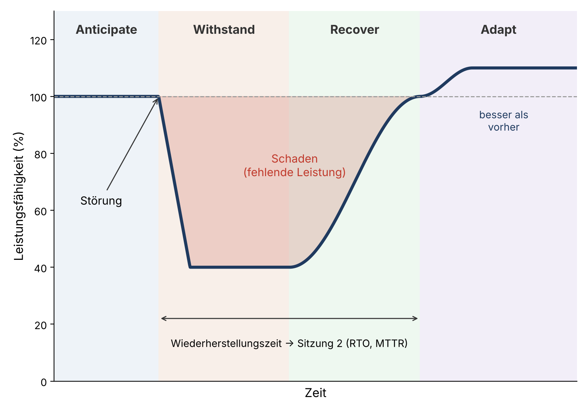
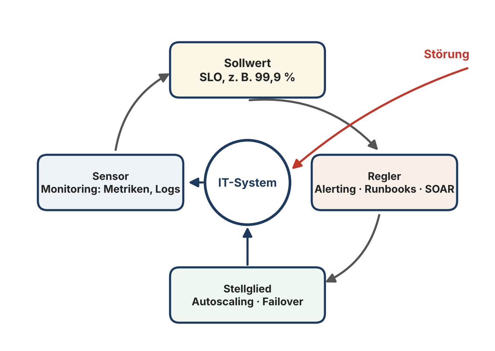
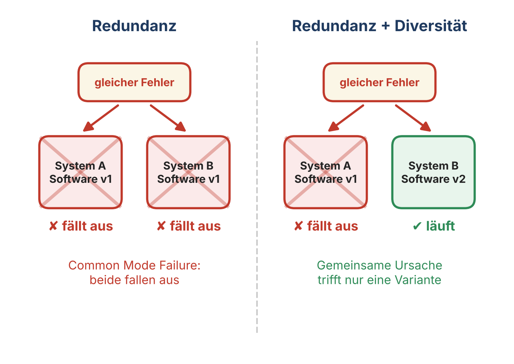
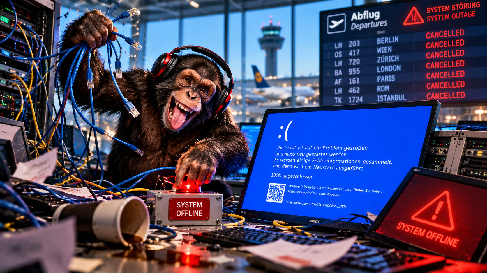
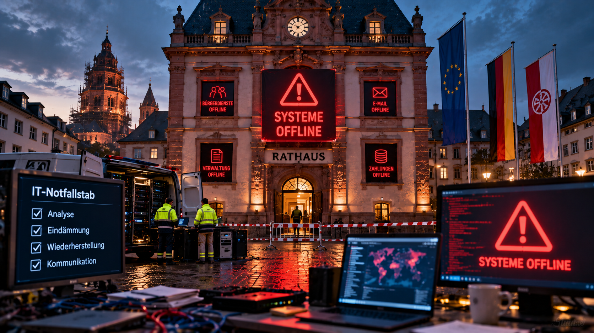
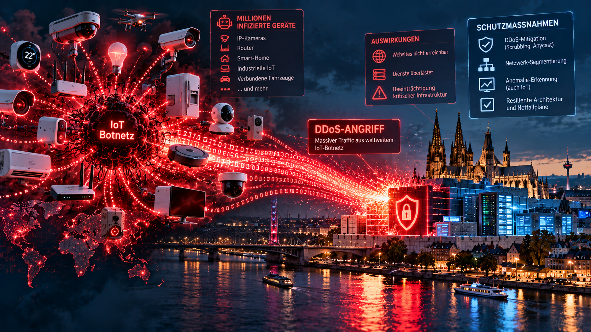

## About …

::: columns
::: {.column width="56%"}
**Prof. Dr. Dirk Loomans**, Diplom-Physiker

- Studium Physik und Informatik (Bayreuth),  Promotion in theoretischer Polymerphysik (Freiburg).
- ehem. Partner Cyber Security and Resilience bei KPMG, CEO Loomans & Matz, CISO Infineon
- Hochschule Mainz, Fachbereich Wirtschaft: Wirtschaftsinformatik, insbesondere Cyber Security und Softwareentwicklung (WiSe 2011/12 – SoSe 2015 und seit SoSe 2025)
- Lehre: Projektmanagement, Cyber-Resilienz, IT-Security, Digital Business
- Forschung: KI und Cyber, Digitale Souveränität
- Fun Fact: Hobbybrauer und Fastnachts-Aficionado
:::
::: {.column width="40%"}
{fig-alt="Porträt Prof. Dr. Dirk Loomans"}
:::
:::

## Zugang zum Kurs in OLAT

Kursunterlagen, Skripte und Ankündigungen liegen in OLAT.

Zugangskennwort: CSMWS26ECR

::: notes
Aktuelles Kennwort vor der Veranstaltung eintragen. Das Kennwort des Vorsemesters wurde aus dem Foliensatz entfernt.
:::

## Semesterüberblick

1. **Grundlagen der Resilienz: Safety & Security** ← heute
2. Modelle und Messbarkeit
3. Resilienz-Architekturen
4. Cyber-Bedrohungen und Resilienzstrategien
5. Resilienz als Organisationsfähigkeit
6. Rollen und Verantwortlichkeiten
7. Technische Resilienz I: Backup, DR, Notfalltests
8. Technische Resilienz II: Zero Trust, Microsegmentation, Cloud, Netz
9. Sonderthemen OT und KI · 10. Resilienz der Zukunft · 11. Klausur

## Agenda

::: columns
::: {.column width="56%"}
- Einleitung & Lernziele
- Begriff und Herkunft der Resilienz
- Safety vs. Security
- Physikalisch-systemische Perspektive
- Technische Resilienzprinzipien
- Standards und Regulierung
- Fallstudien & Übung
- Zusammenfassung & Ausblick
:::
::: {.column width="40%"}
{fig-alt="Gewölbekeller mit dicht gestapelten, verstaubten Sektflaschen"}
:::
:::

::: notes
Bild hier bewusst NICHT auflösen. Frage: „Was hat ein Sektkeller mit Cyber-Resilienz zu tun?“ – Auflösung bei der Folie „Wiederherstellbarkeit: Das Kupferberg-Problem“.
:::

## Lernziele

Nach dieser Sitzung können Sie …

- den Begriff **Resilienz** definieren und von Robustheit, Zuverlässigkeit und Sicherheit abgrenzen,
- den Unterschied zwischen **Safety** und **Security** erläutern,
- technische und organisatorische **Resilienzprinzipien** benennen und anwenden,
- Resilienz in **Cyber-Security-Management, Business Continuity und Incident Response** einordnen.

::: notes
Lernziele 1:1 aus dem Skript. Kurz auf Prüfungsrelevanz hinweisen – Lernfragen stehen am Ende des Skripts.
:::

## Warum Resilienz wichtig ist

IT-Systeme sind nie vollkommen sicher.

Angriffe, Ausfälle und Fehlbedienungen sind unvermeidlich.

**Entscheidend ist: Wie schnell können wir uns erholen und weiterarbeiten?**

Diskussionsfrage: Wie lange darf euer Lieblingsspiel down sein?

::: notes
Server-Ausfälle beim Zocken als Einstieg. Ausfälle sind normal, Erholungsfähigkeit zählt. Überleitung zum CrowdStrike-Beispiel.
:::

## Ausfälle sind normal: 19. Juli 2024

::: columns
::: {.column width="56%"}
- Ein fehlerhaftes Update einer **Sicherheitssoftware** (CrowdStrike Falcon)
- Rund 8,5 Mio. Windows-Rechner bleiben im Bluescreen hängen – Flughäfen, Kliniken, Banken, Sender
- Kein Angriff – und trotzdem ein massiver Sicherheitsvorfall
- Wiederherstellung oft nur manuell, Rechner für Rechner
:::
::: {.column width="40%"}
{fig-alt="Skizze: Abflugtafel an einem Flughafen zeigt einen Bluescreen, davor wartende Reisende"}
:::
:::

::: notes
Plenum: Wer war selbst betroffen (Flug, Arztpraxis, Supermarkt)? Pointe: Ein Security-Produkt verursacht ein Safety-Ereignis – Brücke zu Safety vs. Security. Recovery erforderte vielfach physischen Zugriff (abgesicherter Modus, Datei löschen), BitLocker-Schlüssel wurden zum Engpass.
:::

## Was bedeutet Resilienz?

::: columns
::: {.column width="56%"}
- Resilienz = Widerstands- und Anpassungsfähigkeit bei Störungen.
- Herkunft: Physik, Psychologie, Systemtheorie – heute technische und organisatorische Systeme.
- In der IT: Systeme bleiben trotz Störungen funktionsfähig oder erholen sich schnell.
:::
::: {.column width="40%"}
{fig-alt="Kreislauf Anticipate, Withstand, Recover, Adapt"}
:::
:::

::: notes
Resilienz definieren, Herkunft erwähnen, Alltagsbeispiele abfragen.
:::

## Resilienz ist nicht dasselbe wie …

| Begriff | Leitfrage | Bild |
|---|---|---|
| **Robustheit** | Hält das System der Störung stand, ohne nachzugeben? | Fels |
| **Zuverlässigkeit** | Funktioniert es unter Normalbedingungen dauerhaft? | Uhrwerk |
| **Sicherheit** | Ist es vor Schäden und Angriffen geschützt? | Tresor |
| **Resilienz** | Bleibt es funktionsfähig, erholt es sich – und lernt es? | Bambus im Sturm |

::: notes
Lernziel 1 / Prüfungsfrage 1. Robust = widersteht bis zum Bruch; resilient = darf nachgeben, kehrt aber zurück und passt sich an. Ein robustes System kann spröde versagen (Glas), ein resilientes degradiert kontrolliert.
:::

## Woher kommt der Begriff?

::: columns
::: {.column width="56%"}
- **Materialwissenschaft** (19. Jh.): Rückfederung nach Verformung
- **Psychologie**: Emmy Werner, Kauai-Längsschnittstudie (ab 1955)
- **Ökologie**: C. S. Holling (1973) – Ökosysteme absorbieren Störungen
- **Resilience Engineering**: Hollnagel, Woods & Leveson (2006)
- **Cyber**: NIST SP 800-160 Vol. 2 (2019, Rev. 1 2021)
:::
::: {.column width="40%"}
{fig-alt="Zeitleiste von der Materialwissenschaft über Psychologie und Ökologie bis zur Cyber-Resilienz"}
:::
:::

::: notes
Gemeinsamer Kern über alle Disziplinen: Störung – Absorption – Rückkehr – Anpassung. Kauai: Kinder, die sich trotz widriger Umstände gut entwickelten.
:::

## Resilience Engineering: vier Fähigkeiten

::: columns
::: {.column width="56%"}
- **Anticipate** – Was könnte passieren?
- **Monitor** – Worauf müssen wir achten?
- **Respond** – Was tun wir jetzt?
- **Learn** – Was lernen wir daraus?

Resilienz ist etwas, das ein System **tut** – nicht etwas, das es **hat**.
:::
::: {.column width="40%"}
{fig-alt="Vier Quadranten: Antizipieren, Beobachten, Reagieren, Lernen um ein Zentrum System"}
:::
:::

::: notes
Hollnagel. Soziotechnische Sicht: Menschen und Prozesse gehören dazu. „Learn“ ist das, was Resilienz von reiner Robustheit unterscheidet.
:::

## Die Resilienzkurve

::: columns
::: {.column width="56%"}
- Störung → Leistungsabfall → degradierter Betrieb → Wiederherstellung → Anpassung
- NIST-Ziele: **Anticipate, Withstand, Recover, Adapt**
- Die Fläche „fehlender Leistung“ ist der Schaden
- Resilienz heißt: Abfall flacher, Erholung schneller, danach besser
:::
::: {.column width="40%"}
{fig-alt="Diagramm: Leistungsfähigkeit über die Zeit mit Einbruch nach einer Störung, Erholung und Anpassung über das Ausgangsniveau"}
:::
:::

::: notes
Teaser für Sitzung 2: Wiederherstellungszeit (RTO, MTTR) und Tiefe des Einbruchs lassen sich messen. Frage: Welche Maßnahme verkleinert welche Teilfläche?
:::

## Safety vs. Security – der Unterschied

::: columns
::: {.column width="56%"}
**Safety:** Schutz vor unbeabsichtigten Fehlern und Unfällen – Hardwaredefekt, Stromausfall, Brand.

**Security:** Schutz vor absichtlichen Angriffen – Ransomware, Social Engineering, Hacking.

Beide beeinflussen die Resilienz eines Systems.
:::
::: {.column width="40%"}
{fig-alt="Illustration: links Arbeitsschutz (Safety), rechts Wachmann mit Kamera (Security)"}
:::
:::

::: notes
Safety vs. Security sammeln. Resilienz wird von beidem beeinflusst.
:::

## Wo Safety und Security sich treffen

::: columns
::: {.column width="56%"}
- **Security → Safety:** Stuxnet (2010) – Schadcode zerstört Uranzentrifugen physisch
- **Security → Versorgung:** Colonial Pipeline (2021) – Ransomware in der IT, Pipeline (OT) vorsorglich abgeschaltet, Treibstoffengpässe an der US-Ostküste
- **Safety → Security:** Notbetrieb und Fail-open öffnen Angriffsflächen
- Frage: Wo kippt es bei Smart Home, Auto, Cloud-Gaming?
:::
::: {.column width="40%"}
{fig-alt="Wippe zwischen Safety und Security, in der Mitte ein vernetztes OT-System"}
:::
:::

::: notes
Mini-Case-Diskussion. In vernetzten OT/IoT-Systemen verschwimmt die Grenze. Priorisierung kritischer Funktionen und Abhängigkeiten betonen.
:::

## Resilienz verbindet beides

::: columns
::: {.column width="56%"}
Ziel: nicht Unverwundbarkeit, sondern Reaktions- und Wiederherstellungsfähigkeit.

**Safety + Security + Adaptivität = Resilienz**

Fokus: robust designen, Störungen erkennen, reagieren, wiederherstellen.
:::
::: {.column width="40%"}
{fig-alt="Skizze: Safety plus Security plus Adaptivität ergibt Resilienz"}
:::
:::

## Physikalische Perspektive (Analogie)

::: columns
::: {.column width="56%"}
- Pendel / Schwingkreis: Störung → Auslenkung → Rückkehr zur Balance.
- Elastizität vs. Fragilität: Gummi vs. Glas.
- Übertragung auf IT-Systeme und Organisationen: Monitoring, Alerting und Autoscaling wirken wie Regelkreise.
:::
::: {.column width="40%"}
{fig-alt="Strichzeichnung eines schwingenden Pendels"}
:::
:::

::: notes
Physik-Analogie (Pendel/Schwingkreis). Fragil vs. resilient.
:::

## Der Regelkreis im IT-Betrieb

::: columns
::: {.column width="56%"}
| Regelungstechnik | IT-Betrieb |
|---|---|
| Sollwert | Service Level Objective (SLO) |
| Sensor | Monitoring: Metriken, Logs |
| Regler | Alerting, Runbooks, SOAR |
| Stellglied | Autoscaling, Failover, Isolation |

Falsch gedämpft schwingt auch die IT: zu aggressives Autoscaling oszilliert.
:::
::: {.column width="40%"}
{fig-alt="Regelkreis-Diagramm: Monitoring misst, Alerting entscheidet, Autoscaling greift ein, System liefert neue Messwerte"}
:::
:::

::: notes
Physik-Analogie konkret machen. Unterdämpft = Flapping (Instanzen werden ständig hoch- und runtergefahren), überdämpft = Reaktion zu langsam. Brücke zu SLOs in Sitzung 2.
:::

## Technische Resilienzprinzipien

::: columns
::: {.column width="56%"}
- **Redundanz** – mehrere Wege und Komponenten
- **Diversität** – heterogene Komponenten reduzieren Kaskadenfehler
- **Wiederherstellbarkeit** – Backups, DR-Prozesse, Automatisierung
- **Adaptivität** – Skalierung, Umschalten, Lernen
:::
::: {.column width="40%"}
{fig-alt="Vier Kacheln: Redundanz, Diversität, Wiederherstellbarkeit, Adaptivität"}
:::
:::

::: notes
Überblick, die vier Prinzipien werden auf den nächsten Folien je mit einem Fall unterlegt.
:::

## Redundanz ohne Diversität: Ariane 5

::: columns
::: {.column width="56%"}
- Flug 501 (1996): zwei redundante Trägheitsnavigationssysteme
- Identische Software → identischer Fehler (Zahlenüberlauf), beide fallen kurz nacheinander aus
- Rakete zerstört sich nach ca. 37 Sekunden
- Redundanz schützt vor **zufälligen** Fehlern, nicht vor **gemeinsamen Ursachen** (Common Mode Failure)
:::
::: {.column width="40%"}
{fig-alt="Links zwei identische Systeme, beide rot durchgestrichen; rechts zwei verschiedene Systeme, eines läuft weiter"}
:::
:::

::: notes
Rückbezug auf CrowdStrike: Monokultur bei Betriebssystem und Sicherheitssoftware ist dieselbe Falle im Großformat. Frage: Wo ist eure Redundanz in Wahrheit eine Kopie?
:::

## Wiederherstellbarkeit: Das Kupferberg-Problem

::: columns
::: {.column width="56%"}
- 1960: Kupferberg stellt auf Edelstahltanks um – das Flaschenlager bleibt als **Fallback**
- Heute weiß niemand mehr, welche Flaschen noch voll sind
- Bewegen? Flaschen könnten platzen – Kettenreaktion

**Ein Backup, das nie getestet wurde, ist eine Hoffnung.**
:::
::: {.column width="40%"}
{fig-alt="Gewölbekeller mit dicht gestapelten, verstaubten Sektflaschen"}
:::
:::

::: notes
Auflösung des Agenda-Bilds. „Schrödingers Backup“: Zustand erst beim Restore bekannt. Drei Lehren: (1) Restore regelmäßig testen, (2) ohne Inventar/Dokumentation keine Wiederherstellung, (3) ein ungepflegter Fallback kann selbst zum Risiko werden – enge Kopplung führt zur Kaskade (Safety!).
:::

## Glück ist keine Strategie: Maersk & NotPetya

::: columns
::: {.column width="56%"}
- Juni 2017: NotPetya – Wiper, getarnt als Ransomware, verbreitet über ukrainische Buchhaltungssoftware
- Maersk: Tausende Server, zehntausende PCs unbrauchbar, alle Domain Controller verschlüsselt – bis auf einen
- Der letzte stand in **Ghana** und war wegen eines Stromausfalls offline
- Wiederaufbau in rund zehn Tagen, Schaden mehrere hundert Mio. USD
:::
::: {.column width="40%"}
{fig-alt="Weltkarte mit vielen roten Ausfallpunkten und einem einzelnen grünen Punkt in Ghana"}
:::
:::

::: notes
Gegenstück zu Kupferberg: Hier hat ein unbeabsichtigtes Offline-Backup gerettet – Zufall statt Plan. Lehre: Offline- bzw. unveränderliche Backups der Identitätsinfrastruktur, festgelegte Wiederanlaufreihenfolge.
:::

## Adaptivität: Chaos Engineering

::: columns
::: {.column width="56%"}
- Netflix „Chaos Monkey“ (ab 2011): fährt in Produktion zufällig Instanzen herunter
- Vorgehen: Hypothese → Experiment → Beobachten → Lernen
- Blast Radius klein halten, Abbruchkriterien festlegen
- **Game Days**: geplante Ausfallübungen mit dem ganzen Team
:::
::: {.column width="40%"}
{fig-alt="Comic: Affe mit Kneifzange vor einem Serverrack, Techniker beobachten gelassen die Monitore"}
:::
:::

::: notes
Wer Störungen selbst kontrolliert herbeiführt, ist auf echte vorbereitet. Bezug zu Hollnagel: Learn. Vertiefung in Sitzung 7 (Notfalltests).
:::

## Warum Prävention nicht reicht

::: columns
::: {.column width="56%"}
- Zero-Days, Lieferketten, menschliche Fehler
- 100 % Prävention gibt es nicht.
- **Resilienz ist die letzte Verteidigungslinie.**

„Sicherheit schützt – Resilienz überlebt.“
:::
::: {.column width="40%"}
{fig-alt="Vier Felder: Prevent, Prepare, Respond, Recover"}
:::
:::

::: notes
Warum 100 % Prävention nicht existiert. Merksatz und NIST-Gedanke: Detect – Respond – Recover ergänzen die Prävention.
:::

## Resilienz steht im Gesetz

::: columns
::: {.column width="56%"}
**Standards & Frameworks**

- NIST SP 800-160 Vol. 2 Rev. 1 · ISO/IEC 27031:2025 · BSI-Standard 200-4 · ENISA-Leitfäden

**EU-Regulierung**

- NIS2 – Pflichten und Haftung der Leitung
- DORA – *Digital Operational **Resilience** Act* (seit Januar 2025)
- CER-Richtlinie – *Critical Entities **Resilience***
- Cyber **Resilience** Act – Produkte mit digitalen Elementen
:::
::: {.column width="40%"}
{fig-alt="Landkarte: freiwillige Standards links, verpflichtende EU-Regulierung rechts, Resilienz als verbindender Fluss"}
:::
:::

::: notes
Pointe: Das Wort „Resilienz“ steht inzwischen im Titel von EU-Rechtsakten. Nur Landkarte zeigen, Vertiefung in späteren Sitzungen (Rollen und Verantwortlichkeiten).
:::

## Relevanz für Cyber Security Management

- Resilienz ist ein Management- und Architekturthema.
- Standards liefern das Vorgehen, Regulierung macht Resilienz zur Leitungsaufgabe.
- Verbindung zu Incident Response, BCM und IT Service Continuity Management.

::: notes
Management-Verantwortung betonen, Ausblick auf spätere Sitzungen.
:::

## Fallstudie: Ransomware in der Verwaltung

::: columns
::: {.column width="56%"}
- **Anhalt-Bitterfeld (2021):** erster Cyber-Katastrophenfall Deutschlands, Bürgerdienste monatelang gestört
- **Südwestfalen-IT (2023):** ein kommunaler IT-Dienstleister, rund 70 Kommunen betroffen – Konzentrationsrisiko
- Entscheidend: offline verifizierte Backups, priorisierter Wiederanlauf nach BCM-Plan, Kommunikation

**Frage:** Welche Maßnahmen beschleunigen die Wiederherstellung?
:::
::: {.column width="40%"}
{fig-alt="Skizze: Rathaus mit Schild „Wegen IT-Ausfall geschlossen“, Mitarbeitende arbeiten mit Papierformularen"}
:::
:::

::: notes
Was läuft zuerst wieder an? (Sozialleistungen vor Kfz-Zulassung?) Abhängigkeit von einem Dienstleister = fehlende Diversität auf Organisationsebene.
:::

## Fallstudie: DDoS auf einen Online-Service

::: columns
::: {.column width="56%"}
- **Mirai / Dyn (Oktober 2016):** Botnetz aus IoT-Geräten (Kameras, Router) legt den DNS-Anbieter Dyn lahm – große Plattformen nicht erreichbar
- Maßnahmen: Anycast, CDN, WAF, elastische Kapazität
- DNS bei mehreren Anbietern = Diversität
- Transparente Statuskommunikation
:::
::: {.column width="40%"}
{fig-alt="Viele kleine IoT-Geräte senden Pfeile auf einen einzelnen DNS-Server, davor ein CDN-Schild"}
:::
:::

::: notes
Schließt den Kreis zum Smart Home: unsichere Kameras als Angriffswaffe. Frage: Wie würdet ihr erkennen, dass es ein Angriff und kein Lastspitzen-Erfolg ist?
:::

## Übung: Safety oder Security?

Gruppenaufgabe mit Szenarien: Cloud-Gaming, Krankenhaus-IT, Smart Home, Auto, Banking-App.

1. Risiken identifizieren
2. Safety vs. Security zuordnen
3. Resilienzmaßnahmen vorschlagen

5-Minuten-Kurzpräsentation pro Gruppe.

::: notes
Aufgabenstellung klar, Gruppen bilden, Zeitrahmen nennen.
:::

## Kernpunkte

- **„Sicherheit schützt – Resilienz überlebt.“** Prävention ist notwendig, aber nicht hinreichend.
- Safety und Security adressieren unterschiedliche Ursachen – Resilienz integriert beide.
- **Design for Failure:** Redundanz, Diversität, Wiederherstellbarkeit, Adaptivität.
- Resilienz braucht Technik, Prozesse und Menschen – und lebt von Übung und Lernen.

::: notes
Kernpunkte aus dem Skript. Kurz zurück auf Kupferberg, Ariane und Maersk verweisen: je ein Fall pro Prinzip.
:::

## Ausblick & Hausaufgabe

**Nächste Sitzung:** Modelle und Messbarkeit der Resilienz (RTO/RPO, MTTR, SLOs).

**Hausaufgabe:** Ein Beispiel recherchieren, das sich nach einer Störung besonders schnell erholte.

[Kapitel zum Termin](../../../termine/01.html) · [Glossar](../../../glossar.html) · [Quellen](../../../quellen.html)

::: notes
Hausaufgabe, Teaser auf Sitzung 2 – die Resilienzkurve wird dort messbar.
:::
