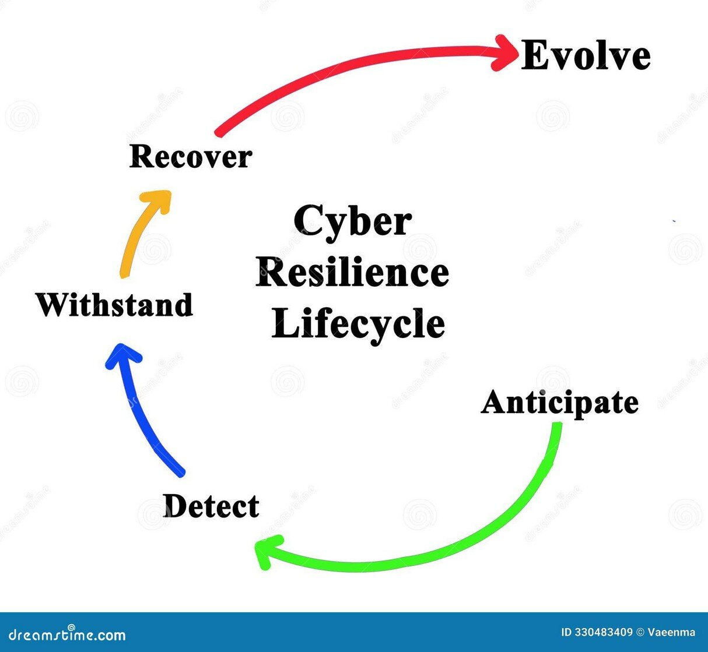
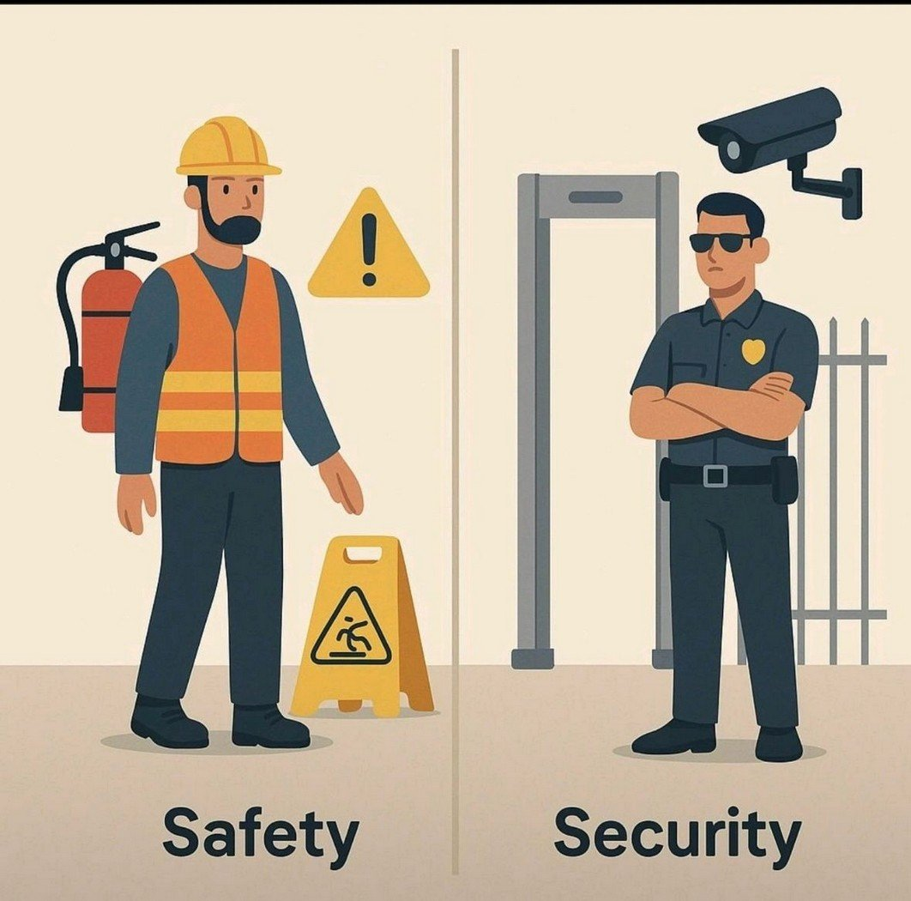
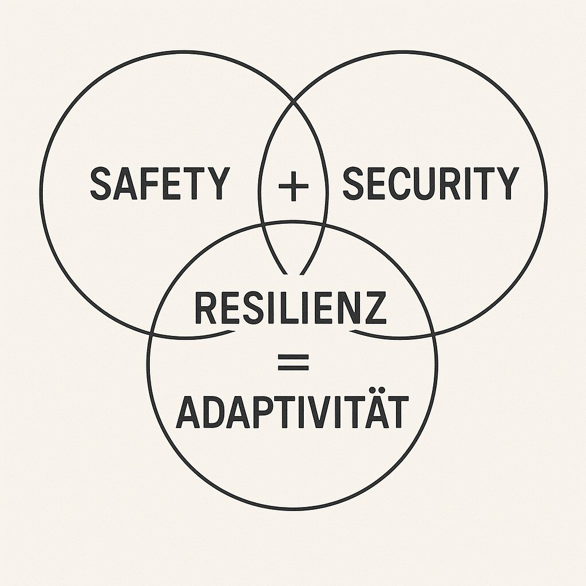
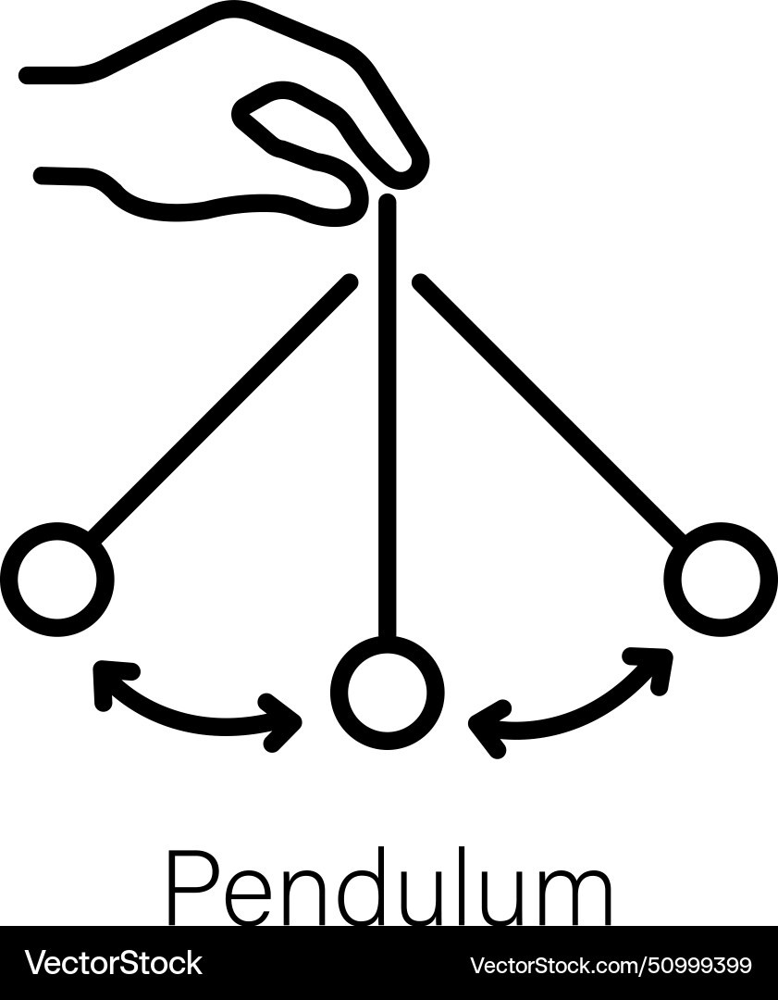
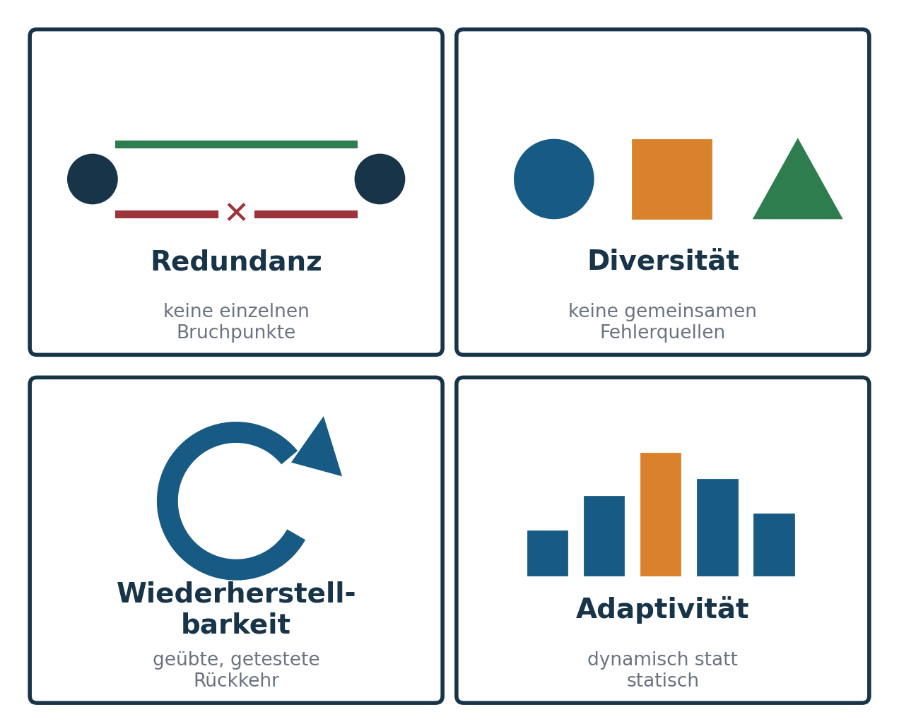
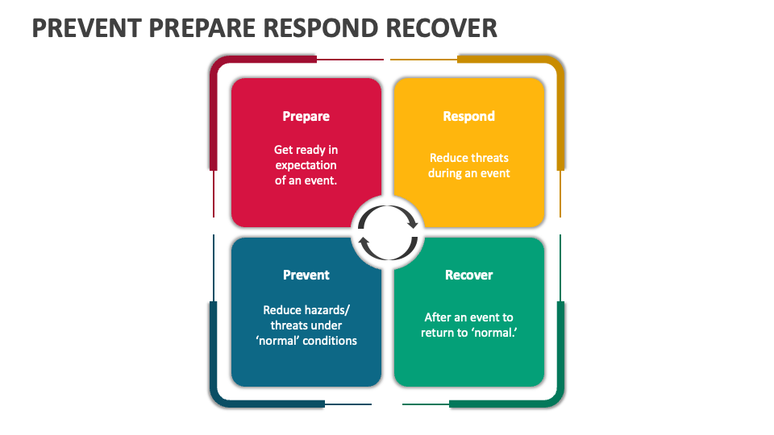

## About …

::: columns
::: {.column width="56%"}
**Prof. Dr. Dirk Loomans**, Diplom-Physiker

- Studium Physik und Informatik (Bayreuth),  Promotion in theoretischer Polymerphysik (Freiburg).
- ehem. Partner Cyber Security and Resilience bei KPMG, CEO Loomans & Matz, CISO Infineon
- Hochschule Mainz, Fachbereich Wirtschaft: Wirtschaftsinformatik, insbesondere Cyber Security und Softwareentwicklung (WiSe 2011/12 – SoSe 2015 und seit SoSe 2025)
- Lehre: Projektmanagement, Cyber-Resilienz, IT-Security, Digital Business
- Forschung: KI und Cyber, Digitale Souveränität
- Fun Fact: Hobbybrauer und Fastnachts-Aficionado
:::
::: {.column width="40%"}
{fig-alt="Porträt Prof. Dr. Dirk Loomans"}
:::
:::

## Zugang zum Kurs in OLAT

Kursunterlagen, Skripte und Ankündigungen liegen in OLAT.

Zugangskennwort: CSMWS26ECR

::: notes
Aktuelles Kennwort vor der Veranstaltung eintragen. Das Kennwort des Vorsemesters wurde aus dem Foliensatz entfernt.
:::

## Semesterüberblick

1. **Grundlagen der Resilienz: Safety & Security** ← heute
2. Modelle und Messbarkeit
3. Resilienz-Architekturen
4. Cyber-Bedrohungen und Resilienzstrategien
5. Resilienz als Organisationsfähigkeit
6. Rollen und Verantwortlichkeiten
7. Technische Resilienz I: Backup, DR, Notfalltests
8. Technische Resilienz II: Zero Trust, Microsegmentation, Cloud, Netz
9. Sonderthemen OT und KI · 10. Resilienz der Zukunft · 11. Klausur

## Agenda

::: columns
::: {.column width="56%"}
- Einleitung & Lernziele
- Grundlagen der Resilienz
- Safety vs. Security
- Technische Resilienzprinzipien
- Physikalisch-systemische Perspektive
- Praktische Beispiele & Fallstudien
- Übung und Reflexionsfragen
- Zusammenfassung & Ausblick
:::
::: {.column width="40%"}
{fig-alt="50000 Flaschen"}
:::
:::

## Warum Resilienz wichtig ist

IT-Systeme sind nie vollkommen sicher.

Angriffe, Ausfälle und Fehlbedienungen sind unvermeidlich.

**Entscheidend ist: Wie schnell können wir uns erholen und weiterarbeiten?**

Diskussionsfrage: Wie lange darf euer Lieblingsspiel down sein?

::: notes
Server-Ausfälle beim Zocken als Einstieg. Ausfälle sind normal, Erholungsfähigkeit zählt. Überleitung zur Definition.
:::

## Was bedeutet Resilienz?

::: columns
::: {.column width="56%"}
- Resilienz = Widerstands- und Anpassungsfähigkeit bei Störungen.
- Herkunft: Physik, Psychologie, Systemtheorie – heute technische und organisatorische Systeme.
- In der IT: Systeme bleiben trotz Störungen funktionsfähig oder erholen sich schnell.
:::
::: {.column width="40%"}
{fig-alt="Kreislauf Anticipate, Withstand, Recover, Evolve"}
:::
:::

::: notes
Resilienz definieren, Herkunft erwähnen, Alltagsbeispiele abfragen.
:::

## Safety vs. Security – der Unterschied

::: columns
::: {.column width="56%"}
**Safety:** Schutz vor unbeabsichtigten Fehlern und Unfällen – Hardwaredefekt, Stromausfall, Brand.

**Security:** Schutz vor absichtlichen Angriffen – Ransomware, Social Engineering, Hacking.

Beide beeinflussen die Resilienz eines Systems.
:::
::: {.column width="40%"}
{fig-alt="Illustration: links Arbeitsschutz (Safety), rechts Wachmann mit Kamera (Security)"}
:::
:::

::: notes
Safety vs. Security sammeln. Resilienz wird von beidem beeinflusst.
:::

## Resilienz verbindet beides

::: columns
::: {.column width="56%"}
Ziel: nicht Unverwundbarkeit, sondern Reaktions- und Wiederherstellungsfähigkeit.

**Safety + Security + Adaptivität = Resilienz**

Fokus: robust designen, Störungen erkennen, reagieren, wiederherstellen.
:::
::: {.column width="40%"}
{fig-alt="Skizze: Safety plus Security plus Adaptivität ergibt Resilienz"}
:::
:::

## Physikalische Perspektive (Analogie)

::: columns
::: {.column width="56%"}
- Pendel / Schwingkreis: Störung → Auslenkung → Rückkehr zur Balance.
- Elastizität vs. Fragilität: Gummi vs. Glas.
- Übertragung auf IT-Systeme und Organisationen: Monitoring, Alerting und Autoscaling wirken wie Regelkreise.
:::
::: {.column width="40%"}
{fig-alt="Strichzeichnung eines schwingenden Pendels"}
:::
:::

::: notes
Physik-Analogie (Pendel/Schwingkreis). Fragil vs. resilient.
:::

## Technische Resilienzprinzipien

::: columns
::: {.column width="56%"}
- **Redundanz** – mehrere Wege und Komponenten
- **Diversität** – heterogene Komponenten reduzieren Kaskadenfehler
- **Wiederherstellbarkeit** – Backups, DR-Prozesse, Automatisierung
- **Adaptivität** – Skalierung, Umschalten, Lernen
:::
::: {.column width="40%"}
{fig-alt="Vier Kacheln: Redundanz, Diversität, Wiederherstellbarkeit, Adaptivität"}
:::
:::

::: notes
Vier Prinzipien mit Cloud-/Netzwerk-Bezug erläutern.
:::

## Safety & Security in Cyber-Systemen

- Beispiele: Smart Home, autonome Fahrzeuge, Cloud-Gaming
- Risikoanalyse: Wo kippt Safety in Security und umgekehrt?
- Priorisierung kritischer Funktionen

::: notes
Mini-Case-Diskussion. Priorisierung und Abhängigkeiten betonen.
:::

## Warum Prävention nicht reicht

::: columns
::: {.column width="56%"}
- Zero-Days, Lieferketten, menschliche Fehler
- 100 % Prävention gibt es nicht.
- **Resilienz ist die letzte Verteidigungslinie.**

„Sicherheit schützt – Resilienz überlebt.“
:::
::: {.column width="40%"}
{fig-alt="Vier Felder: Prevent, Prepare, Respond, Recover"}
:::
:::

::: notes
Warum 100 % Prävention nicht existiert. Merksatz und NIST-Gedanke: Detect – Respond – Recover ergänzen die Prävention.
:::

## Relevanz für Cyber Security Management

- Resilienz ist ein Management- und Architekturthema.
- Einbettung in Standards und Frameworks: NIST, ISO/IEC 27031, BSI 200-4, ENISA.
- Verbindung zu Incident Response, BCM und IT Service Continuity Management.

::: notes
Management-Verantwortung, Standards anreißen, Ausblick auf spätere Sitzungen.
:::

## Praxisbeispiele (Diskussion)

**Ransomware in der Verwaltung** – Recovery und Kommunikation sind entscheidend: offline verifizierte Backups, priorisierter Wiederanlauf nach BCM-Plan.

**DDoS auf einen Online-Service** – Skalierung und Traffic-Filterung: CDN, WAF, elastische Kapazität, transparente Statuskommunikation.

**Frage:** Welche Maßnahmen beschleunigen die Wiederherstellung?

::: notes
Zwei reale Fälle diskutieren. Lösungen fokussieren auf Recovery und Kommunikation.
:::

## Übung: Safety oder Security?

Gruppenaufgabe mit Szenarien: Cloud-Gaming, Krankenhaus-IT, Smart Home, Auto, Banking-App.

1. Risiken identifizieren
2. Safety vs. Security zuordnen
3. Resilienzmaßnahmen vorschlagen

5-Minuten-Kurzpräsentation pro Gruppe.

::: notes
Aufgabenstellung klar, Gruppen bilden, Zeitrahmen nennen.
:::

## Ausblick & Hausaufgabe

**Zusammenfassung:** Safety ≠ Security – Resilienz integriert beides.

**Nächste Sitzung:** Modelle und Messbarkeit der Resilienz.

**Hausaufgabe:** Ein Beispiel recherchieren, das sich nach einer Störung besonders schnell erholte.

[Kapitel zum Termin](../../../termine/01.html) · [Glossar](../../../glossar.html) · [Quellen](../../../quellen.html)

::: notes
Kernaussagen wiederholen, Hausaufgabe, Teaser auf Sitzung 2.
:::
