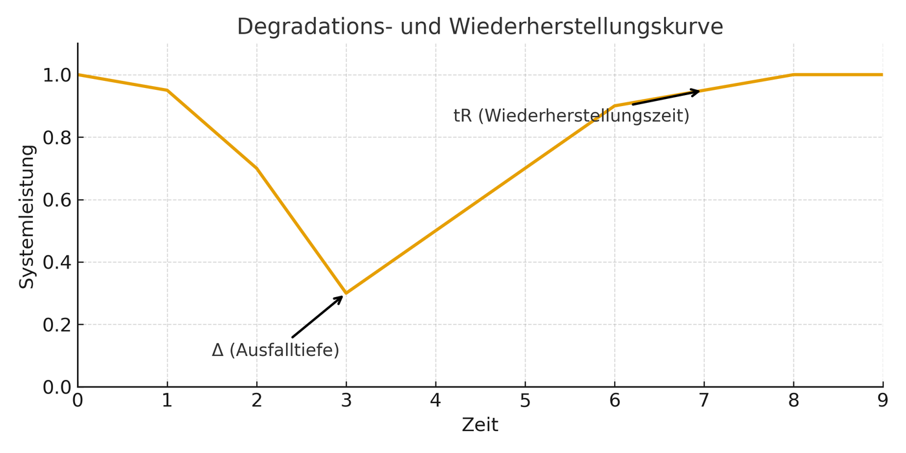
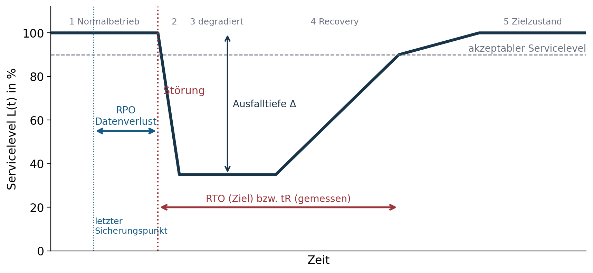
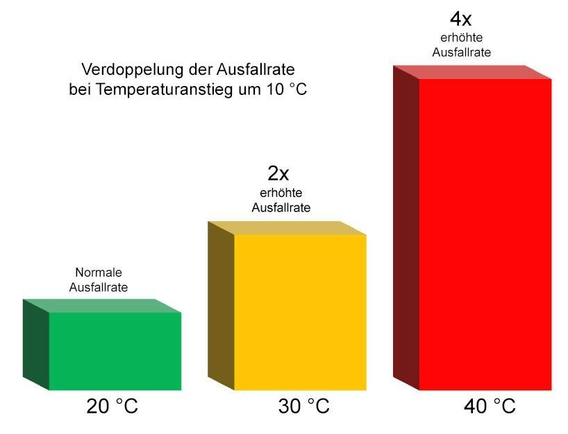
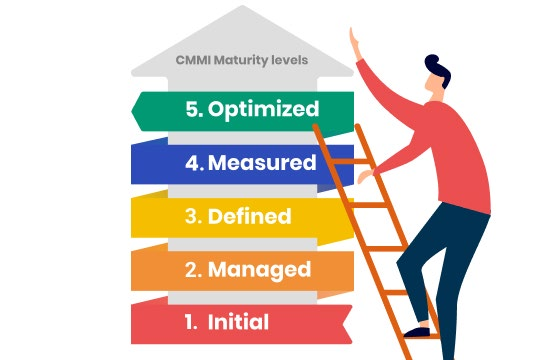
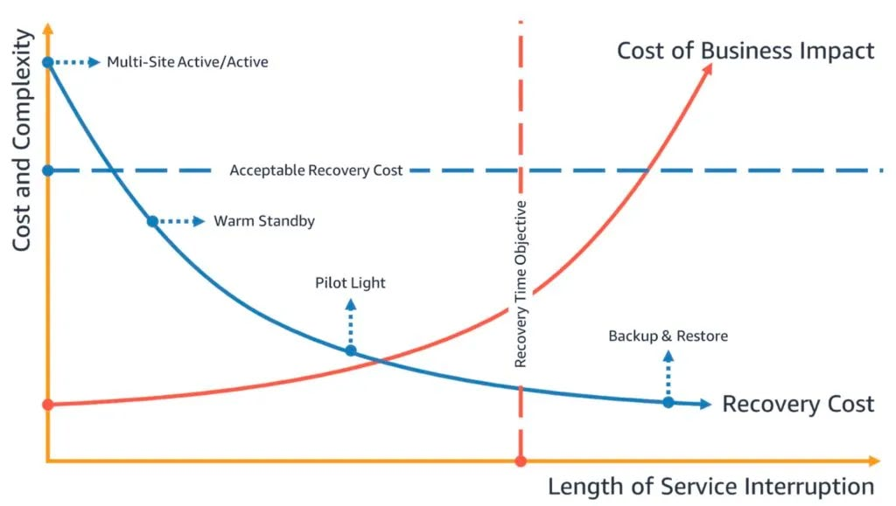

## Agenda

- Rückblick letzte Woche
- Warum Resilienz messen?
- Resilienz als Systemfunktion
- Resilienzmetriken in der IT und grafische Darstellung von RTO und RPO
- Modelle aus Frameworks
- Messmethoden & KPIs · Resilienzreife (Maturity)
- Fallbeispiel Cloud-Ausfall
- Übung: Resilienz bewerten
- Zusammenfassung & Ausblick

## Rückblick Sitzung 1

::: columns
::: {.column width="56%"}
- Safety ≠ Security – beides beeinflusst Resilienz.
- Vier technische Prinzipien: Redundanz, Diversität, Wiederherstellbarkeit, Adaptivität.
- Resilienz = nicht Unverwundbarkeit, sondern Erholungsfähigkeit.
:::
::: {.column width="40%"}
{fig-alt="Dose mit Springknete als Bild für Elastizität"}
:::
:::

## Warum Resilienz messen?

::: columns
::: {.column width="56%"}
- Management braucht Kennzahlen.
- Vergleichbarkeit zwischen Systemen und Organisationen.
- Steuerung und Priorisierung von Investitionen.
- Frühwarnindikatoren für Krisenfähigkeit.
- Nachweisfähigkeit in regulierten Domänen (KRITIS, Finanzaufsicht).
:::
::: {.column width="40%"}
{fig-alt="Warnschild Alert Condition Red"}
:::
:::

## Resilienz als Systemfunktion

::: columns
::: {.column width="56%"}
- Systemleistung über Zeit → „Degradationskurve“
- Zwei Schlüsselgrößen: **Tiefe des Ausfalls (Δ)** und **Wiederherstellungszeit (tR)**
- Ziel: Minimierung von Δ und tR

Resilienz zeigt sich nicht im Normalbetrieb, sondern in der Auslenkung. Die Kurve misst das Ergebnis, nicht den Weg.
:::
::: {.column width="40%"}
{fig-alt="Degradations- und Wiederherstellungskurve"}
:::
:::

## Grafische Darstellung von RTO und RPO

{fig-alt="Schematische Kurve des Servicelevels über die Zeit mit RPO vor der Störung, RTO bis zum akzeptablen Servicelevel und Ausfalltiefe Δ."}

## Resilienzmetriken in der IT

RTO und RPO sind Planungsziele, MTTR und MTBF beobachtete Messwerte.

| Kennzahl | Bedeutung | Beispiel |
|---|---|---|
| RTO | Recovery Time Objective – max. zulässige Wiederherstellungszeit | 2 h für Mailserver |
| RPO | Recovery Point Objective – max. Datenverlust zeitlich | 15 min |
| MTTR | Mean Time to Repair – durchschnittliche Reparaturzeit | 45 min |
| MTBF | Mean Time Between Failures – mittlere Zeit zwischen Fehlern | 30 Tage |

## Ziel vs. Messwert

::: columns
::: {.column width="56%"}
- **RTO / RPO:** normative bzw. vertragliche Anforderung – „Wie lange dürfen wir offline sein? Wie alt dürfen die Daten sein?“
- **MTTR / MTBF:** beobachtete Realwelt-Performance.
- MTBF misst Zuverlässigkeit, nicht Resilienz – ist aber entscheidend für die Risikoexposition.
- Normen fordern Angemessenheit, nicht absolute Minimierung.
:::
::: {.column width="40%"}
{fig-alt="Balkendiagramm: Ausfallrate verdoppelt sich je 10 °C Temperaturanstieg"}
:::
:::

## Modelle aus Frameworks

Frameworks liefern den Ordnungsrahmen, in dem Metriken geplant und bewertet werden.

| Framework | Fokus | Kernelemente |
|---|---|---|
| NIST SP 800-160 Vol. 2 | Cyber Resilience Engineering | Resist, Recover, Re-Constitute, Adapt |
| ISO/IEC 27031 | ICT Readiness for BC | Vorbereitung, Test, Wiederherstellung |
| BSI 200-4 | Business Continuity Management | Reifegrade, Szenarien, Notfallübungen |

::: notes
Hinweis: NIST SP 800-160 Vol. 2 Rev. 1 formuliert die Ziele Anticipate, Withstand, Recover, Adapt. Siehe Quellen, Hinweise zur Aktualität.
:::

## Messgrößen und Frameworks

**Messgrößen erzeugen Evidenz – Frameworks verankern sie strukturell.**

ENISA ergänzt sektorale Perspektiven für KRITIS: Bedrohungsmodelle, Abhängigkeiten, Response- und Recovery-Blueprints.

## Messmethoden & KPIs

- **Technisch:** Monitoring, MTTR, Backup-Tests
- **Organisatorisch:** BCM-KPIs, Audit-Indikatoren
- **Subjektiv:** Selbstbewertungen, Reifegradanalysen

## Resilienzreife (Maturity)

::: columns
::: {.column width="56%"}
Fünf-Stufen-Modell:

1. Ad hoc
2. Repeatable
3. Defined
4. Managed
5. Optimized

Reifegrad = Fähigkeit *vor* dem Ereignis, nicht Performance danach.
:::
::: {.column width="40%"}
{fig-alt="Person steigt eine Leiter der Reifegrade 1 bis 5 hinauf"}
:::
:::

::: notes
Die Stufenbezeichnungen unterscheiden sich zwischen Folien und Skripten. Der BSI-Standard 200-4 selbst kennt Reaktiv-, Aufbau- und Standard-BCMS. Vereinheitlichung prüfen.
:::

## Reifegrad und Metrik

- RTO-Ziel existiert, Recovery-Test nie durchgeführt → geringer Reifegrad trotz Kennzahl.
- MTTR sinkt über die Zeit → Hinweis auf lernende Organisation.
- RPO definiert und Backups getestet → Evidenz statt Policy.

„Hoher Reifegrad ohne gemessene Recovery ist Papiersicherheit; gemessene MTTR ohne organisatorischen Rahmen ist Zufallssicherheit.“

## Fallbeispiel Cloud-Ausfall

::: columns
::: {.column width="56%"}
**Szenario:** AWS-Ausfall – mehrere Regionen betroffen.

**Analyse:** RTO = 3 h, RPO = 30 min.

**Lernen:** Geo-Redundanz und Failover-Strategien verkürzen RTO und RPO.

Architektur, nicht Plattform, entscheidet über Resilienz.
:::
::: {.column width="40%"}
{fig-alt="Diagramm: Kosten der Unterbrechung steigen, Wiederherstellungskosten sinken mit der Dauer"}
:::
:::

## Weitere Fälle aus dem Skript

**Ransomware in einer Kommunalverwaltung:** mehrtägiger Notbetrieb, Wiederanlauf nur aus Offline-Backups – niedrige Resilienz trotz vorhandener Backups.

**Cloud-Gaming-DDoS:** Service verlangsamt statt ausgefallen – Graceful Degradation statt Hard-Fail.

Resilienz bewertet nicht, ob ein Ereignis eintritt, sondern wie ein System danach aussieht.

## Übung: Resilienz bewerten

Gruppenarbeit (30 Minuten):

- Wählt ein IT-System aus (Uni-E-Mail, Cloud-Speicher, Banking-App, Cloud-Gaming, Smart Home).
- Bewertet die Resilienz anhand von RTO, RPO, MTTR.
- Nutzt das Reifegradmodell zur Einordnung.
- Fazit: resilient, bedingt resilient oder fragil?
- Präsentiert kurz eure Ergebnisse.

## Zusammenfassung & Ausblick

- Resilienz wird messbar durch RTO/RPO und Frameworks.
- Maturity-Modelle helfen bei Bewertung und Verbesserung.
- Nächste Sitzung: Resilienz-Architekturen – Strategien zur Resilienzsteigerung.

## Hausaufgabe

Recherchieren Sie ein reales IT-Ereignis (z. B. AWS-Ausfall, Ransomware-Vorfall, Rechenzentrumsbrand).

Analysieren Sie, wie schnell der Dienst wiederhergestellt wurde (RT) und welche Daten gegebenenfalls verloren gingen (RP).

## Material

[Kapitel zum Termin](../../../termine/02.html) · [Glossar](../../../glossar.html) · [Quellen](../../../quellen.html)
