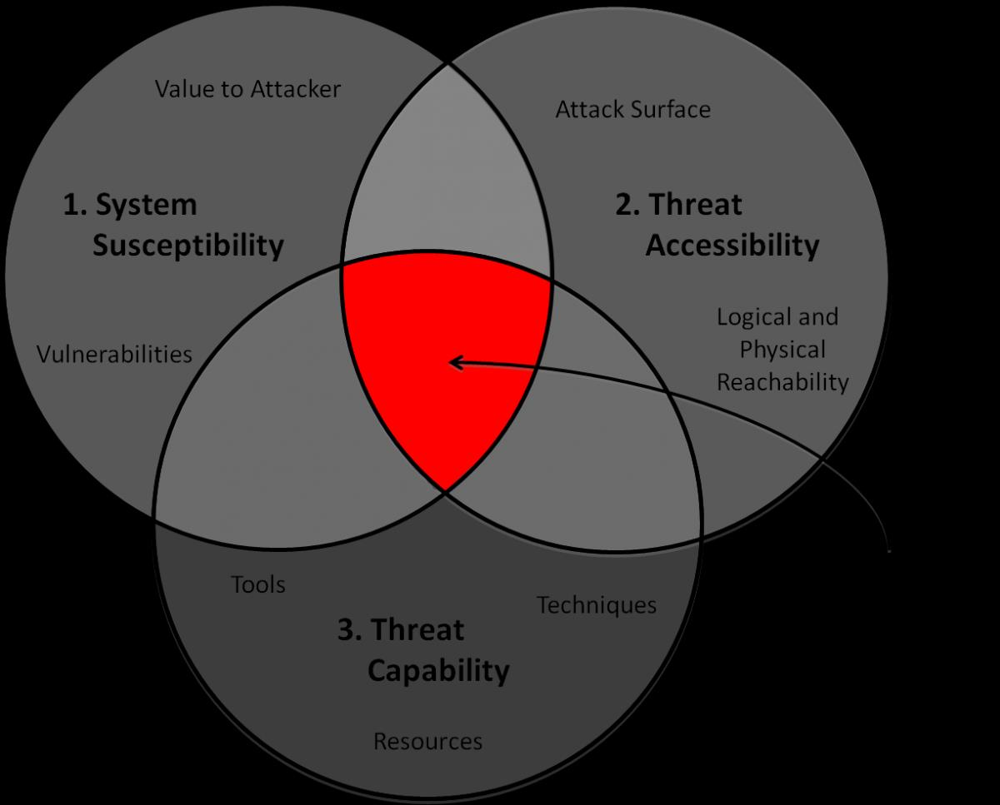
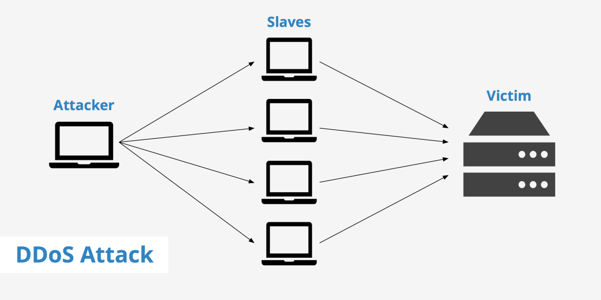
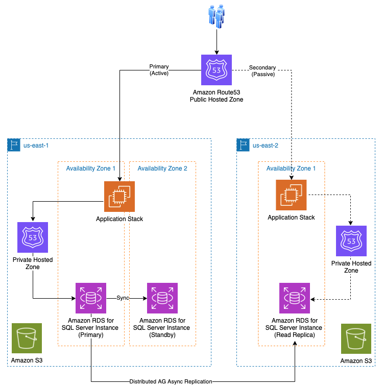
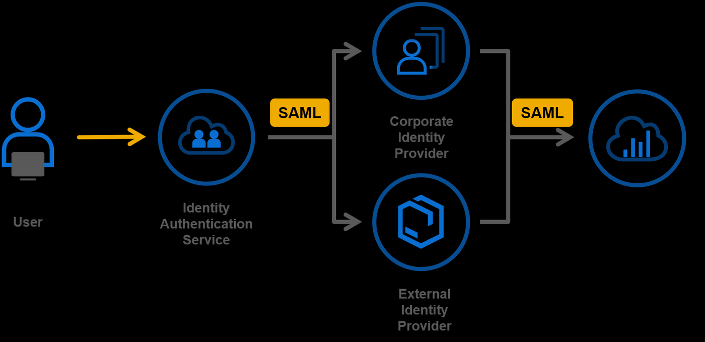
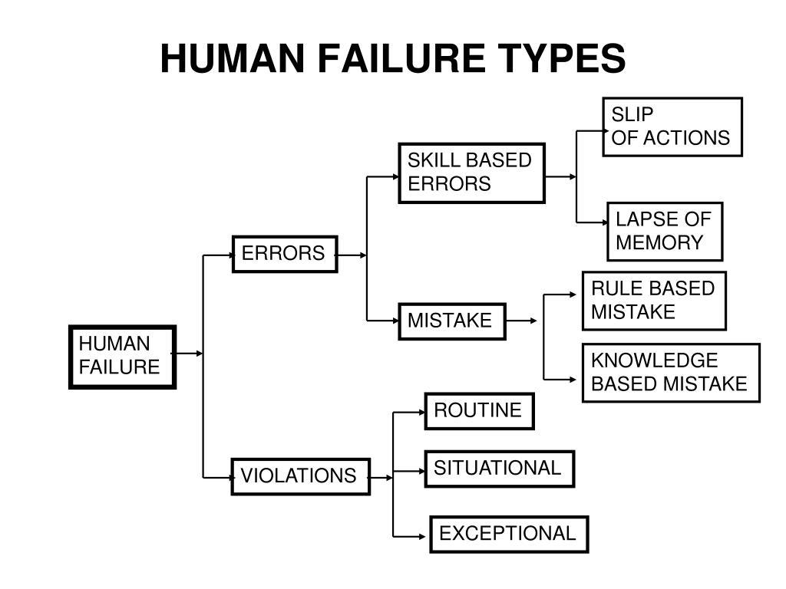
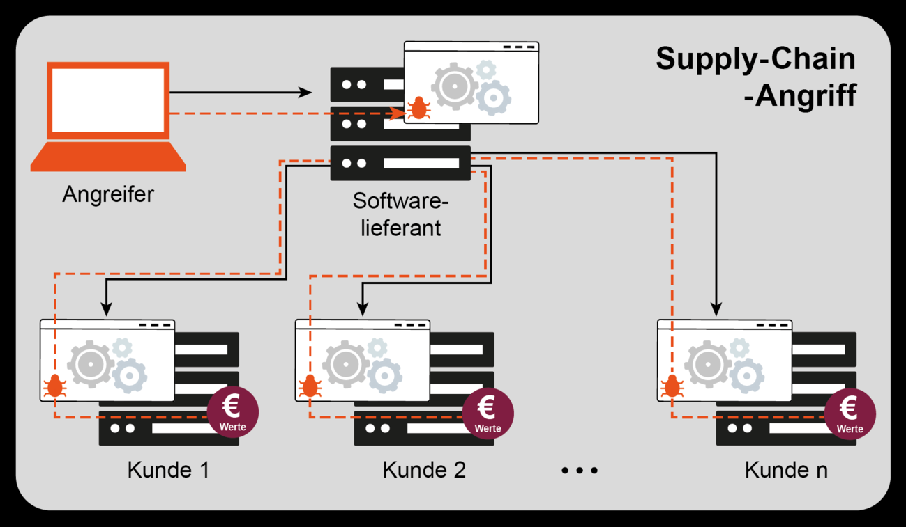
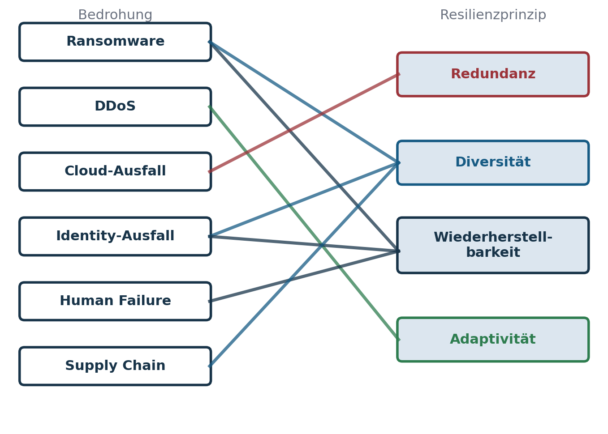

## Agenda

- Rückblick & Anschluss
- Warum Bedrohungs-Mapping essenziell ist
- Bedrohung 1–6: Ransomware, DDoS, Cloud-Ausfall, Identity-Ausfall, Human Failure, Supply Chain
- Framework-Abgleich: Threat → Resilience Capability
- Übung (Gruppenarbeit)
- Zusammenfassung & Ausblick

## Rückblick & Anschluss

::: columns
::: {.column width="56%"}
- Letzte Sitzung: Resilienz entsteht im Design.
- Vier Prinzipien → Redundanz, Diversität, Wiederherstellbarkeit, Adaptivität.
- Heute: bedrohungsgetriebener Blick.
- Ziel: Mapping von Attacken auf Resilienzmechanismen.
:::
::: {.column width="40%"}
{fig-alt="Aufgebrochenes Schloss vor Binärcode"}
:::
:::

## Warum Bedrohungs-Mapping essenziell ist

::: columns
::: {.column width="56%"}
- Resilienz = Widerstand + Wiederherstellung gegen konkrete Ereignisse.
- Ohne Threat-Bezug → Maßnahmen im Leeren.
- Mapping ermöglicht Priorisierung & Budgetfokus.
- Grundlage für Risk-based Resilience Engineering.

Resilienz ist relational: Ein System ist resilient *gegen etwas*.
:::
::: {.column width="40%"}
{fig-alt="Venn-Diagramm aus Anfälligkeit, Zugänglichkeit und Fähigkeit des Angreifers"}
:::
:::

## Bedrohung 1: Ransomware

::: columns
::: {.column width="56%"}
**Wirkprinzip:** Verschlüsselung / Sabotage von Primärsystemen und Backups

**Resilienzstrategien (nicht Prävention!)**

- Immutable / Offline-Backups
- Netzwerk- und Domain-Segmentierung
- Gold-Image / Clean-Room-Recovery
- Recovery-Tests statt Papierpläne

**Zielgröße:** RTO ↓ / RPO ↓ trotz kompromittierter Produktion
:::
::: {.column width="40%"}
{fig-alt="Ablauf Ransomware: Verschlüsselung, Lösegeld in Bitcoin, Schlüssel"}
:::
:::

## Bedrohung 2: DDoS / Lastangriffe

::: columns
::: {.column width="56%"}
**Wirkprinzip:** Service wird durch Überlast unbenutzbar, obwohl technisch intakt

**Resilienzstrategien**

- Anycast-CDN / Traffic-Scrubbing
- Auto-Scaling & Rate-Limiting
- Graceful Degradation (nicht alles oder nichts)
- API-Quota / Circuit Breaker

**Ziel:** Dienst bleibt nutzbar — nicht perfekt, aber funktional
:::
::: {.column width="40%"}
{fig-alt="Angreifer steuert viele Rechner gegen einen Server"}
:::
:::

## Bedrohung 3: Cloud-Provider-Ausfall / Region Down

::: columns
::: {.column width="56%"}
**Wirkprinzip:** Redundanz auf Anbieter-Level bricht weg

**Resilienzstrategien**

- Multi-AZ-Deployment
- Cross-Region-Failover
- Multi-Cloud für kritische Workloads
- Lokaler Fallback für Mindestfunktion

**Lehrsatz:** Provider ≠ Resilienz — Architektur entscheidet
:::
::: {.column width="40%"}
{fig-alt="Architektur mit mehreren Cloud-Regionen und Failover"}
:::
:::

## Bedrohung 4: Identity-Ausfall (IdP als SPOF)

::: columns
::: {.column width="56%"}
**Wirkprinzip:** Systeme technisch verfügbar — aber nicht benutzbar (Lockout)

**Resilienzstrategien**

- Break-Glass-Accounts (lokal & offline)
- Zweiter unabhängiger IdP / Fallback-Authentisierung
- Notfallzugang ohne Cloud-Abhängigkeit
- Minimierung globaler Koppelstellen

**Kernaussage:** Identity ist oft der versteckte Single Point of Failure
:::
::: {.column width="40%"}
{fig-alt="Anmeldefluss über einen zentralen Identity Provider mit SAML"}
:::
:::

## Bedrohung 5: Human Failure / Fehlkonfiguration

::: columns
::: {.column width="56%"}
**Wirkprinzip:** Fehler propagieren systemisch (IaC, CI/CD, Admin-Fehler)

**Resilienzstrategien**

- Vier-Augen- / SoD-Kontrollen
- Staging / Canary Deployment / Feature Flags
- Rollback- / Snapshot-Fähigkeit
- Auditierbarkeit & Post-Mortem-Kultur

**Prinzipbezug:** Diversität & Wiederherstellbarkeit > Prävention
:::
::: {.column width="40%"}
{fig-alt="Baumdiagramm der Fehlerarten: Errors und Violations"}
:::
:::

## Bedrohung 6: Supply-Chain-Angriff

::: columns
::: {.column width="56%"}
**Wirkprinzip:** Kompromittierung kommt über Dritte in die eigene Umgebung (SolarWinds, Kaseya)

**Resilienzstrategien**

- Lieferantendiversität / Source of Truth trennen
- Zero Trust for Dependencies
- Offline-Verifikation / kein Auto-Push bei kritischen Komponenten
- Recovery unabhängig vom kompromittierten Dependency-State

**Lehrsatz:** Resilienz ist hier das Sicherheitsnetz nach dem Vertrauensbruch
:::
::: {.column width="40%"}
{fig-alt="Angreifer kompromittiert Softwarelieferanten und damit mehrere Kunden"}
:::
:::

## Framework-Abgleich: Threat → Resilience Capability

Die Bedrohung entscheidet nicht über das Tool, sondern über das Prinzip.

| Bedrohung | Resilienzprinzip | Normativer Bezug |
|---|---|---|
| Ransomware | Recovery / Diversität (immutable, offline) | ISO/IEC 27031 · BSI 200-4 |
| DDoS | Adaptivität (Autoscale, Graceful Degradation) | ENISA DDoS Guidance |
| Cloud-Ausfall | Redundanz (Multi-AZ/Region) | NIST SP 800-160 Vol. 2 |
| Identity-Ausfall | Diversität / Break-Glass | NIST CSF · Zero Trust |
| Human Failure | Wiederherstellbarkeit / SoD | BSI 200-4 · IT-Grundschutz |
| Supply Chain | Diversität / Zero Trust | ENISA Supply Chain Guidance |

## Was das Mapping zeigt

::: columns
::: {.column width="56%"}
- Verschiedene Bedrohungen adressieren dasselbe Prinzip (Ransomware und Human Failure → Recovery).
- Dasselbe Prinzip wirkt gegen verschiedene Bedrohungen (Diversität gegen Identity-Ausfall und Supply Chain).
- Nicht die Bedrohung wird kontrolliert, sondern die Fähigkeit, ihren Effekt zu absorbieren.
:::
::: {.column width="40%"}
{fig-alt="Linien von sechs Bedrohungen zu vier Resilienzprinzipien"}
:::
:::

## Übung (Gruppenarbeit)

Wählt eine Bedrohung (Ransomware, DDoS, Cloud-Ausfall, Identity-Ausfall, Human Failure, Supply Chain). 15–20 Minuten:

1. Wirkmechanismus beschreiben (1–2 Sätze)
2. Mindestens zwei Resilienzprinzipien zuordnen
3. Jeweils eine konkrete technische Maßnahme nennen
4. Fazit: Wodurch wird das System praktisch resilient?

Output: eine Folie pro Gruppe, max. sechs Bulletpoints. Bewertet wird die Schärfe der Zuordnung.

## Zusammenfassung & Ausblick

- Resilienz bewertet sich immer gegen eine Bedrohung.
- Threat-→-Capability-Mapping schafft Architekturdisziplin.
- Dieselben vier Prinzipien greifen über Bedrohungsklassen hinweg.
- Hybrid erhöht sowohl Angriffsfläche als auch Gegenstrategieraum.

**Nächste Sitzung (5):** Resilienz als Organisationsfähigkeit — Rollen, Prozesse, Übungen, Governance

## Material

[Kapitel zum Termin](../../../termine/04.html) · [Glossar](../../../glossar.html) · [Quellen](../../../quellen.html)
