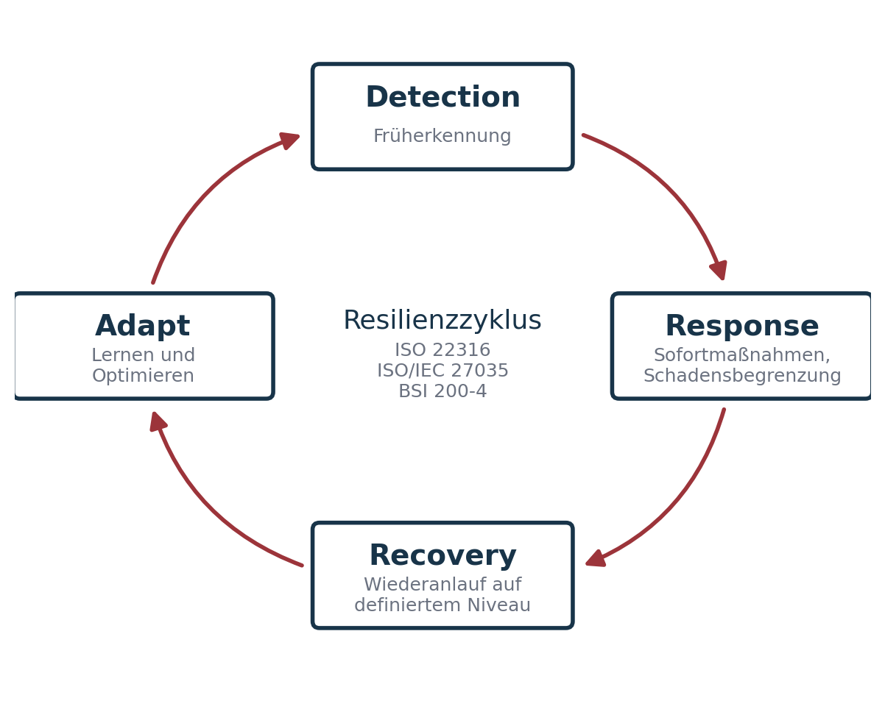

## Agenda

- Rückblick & Zielsetzung
- Organisationale Resilienz und Resilienzzyklus
- Rollen und Verantwortlichkeiten
- Kommunikation unter Stress · Schulz von Thun
- Incident-Response-Prozess
- Übungs- und Trainingskultur · Governance
- Übung (Gruppenarbeit) · Kultur & Lernen
- Zusammenfassung & Ausblick

## Rückblick & Zielsetzung

**Technik schafft Potenzial – Organisation aktiviert es.**

- Technische Resilienz sichert Systeme.
- Organisationale Resilienz sichert Entscheidungen.
- Im Ernstfall entscheidet nicht Technologie, sondern Verhalten.
- Fokus heute: Menschen, Prozesse, Kommunikation, Rollen.

## Was ist organisationale Resilienz?

Definition nach ISO 22316: „Die Fähigkeit einer Organisation, Störungen vorherzusehen, sich vorzubereiten, zu reagieren und sich anzupassen, um in einem sich verändernden Umfeld zu überleben und zu gedeihen.“

- **Strukturen** → klare Rollen & Verantwortlichkeiten
- **Prozesse** → Detection, Reaktion, Wiederanlauf
- **Menschen** → Ausbildung, Training, Entscheidungsfähigkeit
- **Kultur** → Fehleroffenheit & Lernfähigkeit

## Der Resilienzzyklus

::: columns
::: {.column width="52%"}
- **Detection:** Früherkennung von Störungen
- **Response:** Sofortmaßnahmen und Schadensbegrenzung
- **Recovery:** Wiederanlauf auf definiertem Niveau
- **Adapt:** Lernen und Optimieren nach jedem Ereignis

Bezug: ISO 22316 · ISO/IEC 27035 · BSI 200-4
:::
::: {.column width="44%"}
{fig-alt="Kreislauf Detection, Response, Recovery, Adapt."}
:::
:::

## Rollen und Verantwortlichkeiten in der Resilienzorganisation

Kernprinzip: „Wer entscheidet was, wann und warum?“

| Rolle | Hauptaufgabe |
|---|---|
| CISO | Strategische Leitung, Entscheidung über Eskalationsstufen |
| Incident Commander | Operative Gesamtkoordination im Ereignisfall |
| IT Operations | Technische Eindämmung und Wiederherstellung |
| Kommunikation / PR | Interne & externe Information |
| Management Board | Ressourcenfreigabe, Business-Priorisierung |

## Entscheidungslogik in Krisen

- Rollen statt Personen – die Organisation bleibt handlungsfähig, wenn Einzelne fehlen.
- Der Linienweg ist zu langsam: Entscheidungskompetenz auf Zeit (Incident Command System).
- Command priorisiert · Operations handelt · Support dokumentiert und kommuniziert.
- Unity of Command · Span of Control (5–7) · Delegation · Nachvollziehbarkeit · Training.

## Kommunikation unter Stress

**Krisenkommunikation ist Teil der Resilienzarchitektur.**

- Viele Vorfallsbehandlungen scheitern an Informationsfehlern, nicht an Technik.
- Prinzipien: **Clear · Concise · Confirmed · Coordinated**
- „Eine Info ist nur so gut wie ihre Bestätigung.“
- Kommunikationskanäle müssen vorher definiert und getestet sein.

## Exkurs: Kommunikation nach Schulz von Thun

Jede Botschaft hat vier Ebenen. Beispiel im IT-Incident – Admin sagt: „Der Server ist schon wieder down.“

| Ebene | Frage | Botschaft |
|---|---|---|
| Sachinhalt | Worüber informiere ich? | Der Server ist nicht erreichbar. |
| Selbstoffenbarung | Was zeige ich von mir? | Ich bin genervt / gestresst. |
| Beziehung | Was halte ich vom anderen? | Ihr hättet das früher merken müssen. |
| Appell | Was will ich erreichen? | Bitte tut endlich was! |

## Kommunikationsübung: Vier Seiten einer Nachricht

3er-Gruppen, 10 Minuten. Analysiert die Aussage aus einer Incident-Situation:

**„Warum habt ihr das Backup noch nicht eingespielt?“**

- Welche Botschaften stecken in den vier Ebenen?
- Wie könnte dieselbe Aussage resilienter formuliert werden?
- Welche Missverständnisse entstehen, wenn nur eine Ebene gehört wird?
- Welche Kommunikationsregeln helfen, in Stresslagen klar zu bleiben?

## Incident-Response-Prozess

Standardphasen nach ISO/IEC 27035 (laut Unterlagen):

1. Detection & Reporting – Ereignis erkennen und melden
2. Triage & Classification – Kritikalität bestimmen
3. Containment – Ausbreitung stoppen
4. Eradication – Ursache beseitigen
5. Recovery – Systeme wiederherstellen
6. Lessons Learned – Erkenntnisse in Prozesse zurückführen

Jede Phase braucht definierte Owner, Playbooks und Kommunikationskanäle.

::: notes
Die Phasengliederung von ISO/IEC 27035-1 ist gröber; die sechsstufige Gliederung entspricht eher NIST SP 800-61 Rev. 2. Siehe Hinweise zur Aktualität.
:::

## Übungs- und Trainingskultur

**Resilienz ist keine Theorie – sie entsteht durch Übung.**

- **Tabletop-Übungen:** Planspiel, Fokus auf Kommunikation und Entscheidungswege
- **Live-Simulationen:** technische Reaktionsfähigkeit unter Realbedingungen
- **After-Action Reviews:** strukturiertes Feedback, keine Schuldzuweisung
- **Metriken:** Time-to-Detect, Time-to-Decision, Time-to-Recover

## Resilienz-Governance

- Integration in ISMS, BCMS und Risk Management
- Regelmäßige Reviews, Tests und Audits
- Kennzahlen: RTO-Erreichung, Übungshäufigkeit, Lessons-Learned-Umsetzung
- Berichtspflicht an Management und Aufsichtsgremien
- Reifegradbewertung, etwa nach BSI 200-4 oder ISO 22301

„Resilienz ist keine Projektaufgabe, sondern Führungsverhalten.“

## Übung (Gruppenarbeit)

**Szenario:** Am Montagmorgen bemerkt die IT, dass mehrere File-Server verschlüsselt sind und eine Lösegeldforderung erscheint. Cloud-Sync ist betroffen, VPN läuft noch.

15–20 Minuten:

1. Wer übernimmt die Incident-Leitung?
2. Welche Systeme oder Personen müssen sofort informiert werden?
3. Welche Entscheidungen sind in den ersten 30 Minuten kritisch?
4. Wie läuft die interne und externe Kommunikation?
5. Welche Priorität hat Recovery vs. Forensik?

## Kultur & Lernen

**Resilienz ist ein soziales Phänomen.**

- **Blame-free Post-Mortems:** Fokus auf Ursache, nicht Schuld
- **Transparente Kommunikation:** Fehler werden geteilt, nicht versteckt
- **Institutionelles Lernen:** Lessons Learned → Process Improvement
- **Psychologische Sicherheit:** Teams dürfen Fehler zugeben (und machen)

## Zusammenfassung & Ausblick

- Organisationale Resilienz = Fähigkeit zur koordinierten Reaktion.
- Rollen, Kommunikation und Übung sind die entscheidenden Faktoren.
- Recovery muss nicht nur technisch, sondern auch organisatorisch funktionieren.
- Lernen ist Teil des Zyklus, nicht dessen Nachbereitung.

**Ausblick Sitzung 6:** Rollen und Verantwortlichkeiten – CISO, SOC, CERT

## Material

[Kapitel zum Termin](../../../termine/05.html) · [Glossar](../../../glossar.html) · [Quellen](../../../quellen.html)
