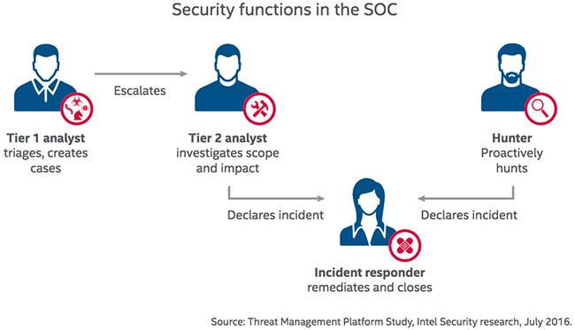
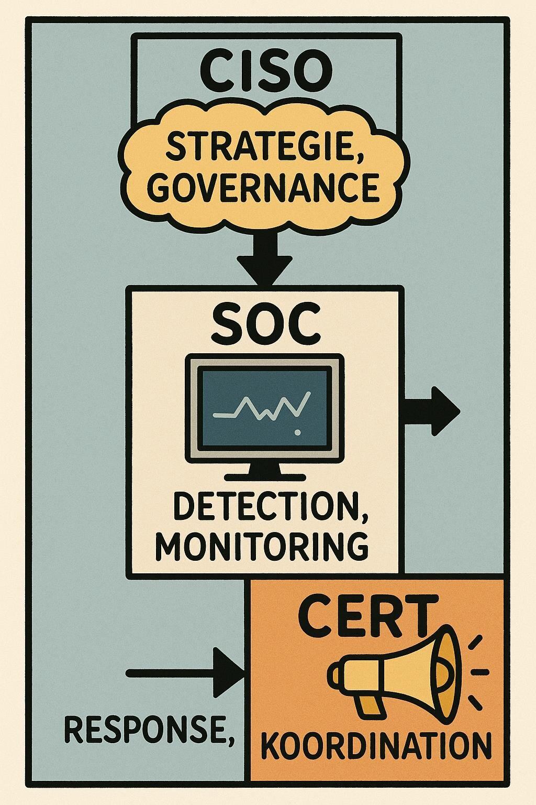
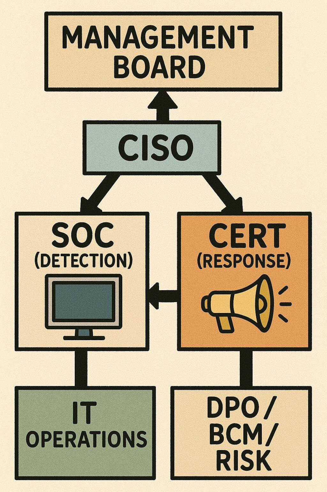

## Agenda

- Rückblick · Zielsetzung
- Vom Individuum zur Organisation
- CISO, SOC und CERT
- Weitere Schlüsselrollen in der Cyber-Organisation
- Kommunikations-, Eskalationsmodell und Konflikte
- Best Practices & Standards
- Übung (Gruppenarbeit)
- Zusammenfassung & Ausblick

## Rückblick

**Organisationale Resilienz in Aktion**

- Kommunikation als Schlüsselfaktor der Resilienz
- Unterschied zwischen Struktur und Verhalten
- Bedeutung von Rollenverständnis und Eskalationslogik
- „Resilienz ist Teamarbeit – aber nur, wenn das Team dieselbe Sprache spricht.“
- Fallbeispiel: Ransomware – Lehren aus der Praxis

## Zielsetzung

- Die zentralen Rollen der Cyber-Resilienz verstehen (CISO, SOC, CERT, DPO, BCM, IT Ops, Management)
- Zusammenspiel und Eskalationslogik analysieren
- Typische Konflikte und Governance-Lösungen erkennen
- Rollenverantwortung in einer praktischen Übung anwenden

## Vom Individuum zur Organisation

::: columns
::: {.column width="56%"}
**Warum Rollen das Rückgrat der Resilienz sind**

- Technik kann reagieren – Menschen entscheiden.
- Klare Rollen verhindern Chaos und Doppelarbeit.
- Verantwortung ersetzt Schuld.
- Ohne Struktur keine Geschwindigkeit.

**Beispiele:** Wer schaltet Systeme ab, wenn Malware erkannt wird? Wer informiert Behörden oder Kunden? Wer genehmigt öffentliche Kommunikation?
:::
::: {.column width="40%"}
{fig-alt="Motiv: Es ist nicht deine Schuld. Es ist deine Verantwortung."}
:::
:::

## Die Rolle des CISO

**Position und Mandat**

- Strategische Verantwortung für Informationssicherheit und Cyber-Resilienz
- Bindeglied zwischen Technik, Management und Aufsicht
- Steuerung des ISMS (ISO/IEC 27001) und Koordination von SOC / CERT
- Beratung der Geschäftsleitung zu Cyber-Risiken und Compliance (z. B. NIS-2)

**Herausforderungen:** fehlendes Mandat oder Ressourcen („Accountability without Authority“) · Interessenkonflikt Security vs. Business · Kommunikationslücke „Tech vs. Business“

## Das Security Operations Center (SOC)

::: columns
::: {.column width="56%"}
**Zentrale Aufgaben**

- 24/7-Überwachung von Systemen und Netzwerken
- Erkennung und Analyse von Sicherheitsereignissen (Monitoring & SIEM)
- Eskalation an Incident-Response-Team / CERT
- Dokumentation, Reporting, Threat-Intelligence-Einbindung

**Organisation:** Schnittstellen zu IT Operations, CISO-Office, Datenschutz, Management
:::
::: {.column width="40%"}
{fig-alt="SOC-Funktionen: Tier-1- und Tier-2-Analyst, Hunter, Incident Responder"}
:::
:::

## SOC – Tier 1–3

Resilienz entsteht durch Funktionstrennung und Spezialisierung – nicht durch Mehrarbeit.

| Ebene | Bezeichnung | Aufgabe |
|---|---|---|
| Tier 1 | Monitoring / Analysis | erste Alarmbewertung, Triage, Eskalation |
| Tier 2 | Investigation | vertiefte Analyse, Kontext, Angriffsketten |
| Tier 3 | Response / Threat Hunting | Eindämmung, Forensik, proaktive Suche |

::: notes
Herausforderungen ansprechen: Alarm Fatigue, Personalmangel, Tool-Fragmentierung. Antworten: SOAR, Playbooks, Risikopriorisierung, Training.
:::

## Das Computer Emergency Response Team (CERT)

**Mandat und Aufgaben**

- Koordination der technischen Incident-Response-Aktivitäten
- Kommunikation mit internen Stakeholdern und externen Partnern (BSI, ENISA, Branchen-CERTs)
- Analyse, Forensik, Wiederanlaufunterstützung
- Lessons-Learned-Dokumentation und Nachbereitung

**Typen:** Internal CERT (Unternehmen, Konzern) · National CERT (z. B. CERT-Bund) · Sectoral CERT (Finanz, Energie usw.)

## Zusammenspiel von CISO – SOC – CERT

::: columns
::: {.column width="56%"}
**Funktionale Trennung = Resilienz durch Arbeitsteilung**

- CISO → Richtlinien, Ressourcen, Reporting (strategisch)
- SOC → Erkennen, Bewerten, Eskalieren (operativ)
- CERT → Koordinieren, Reagieren, Lernen (taktisch)

**Zentrale Erfolgsfaktoren:** definierte Eskalationsschwellen · gemeinsames Lagebild (Single Source of Truth) · regelmäßige Lage- und Lessons-Learned-Meetings
:::
::: {.column width="40%"}
{fig-alt="Pyramide: CISO Strategie, SOC Detection, CERT Response"}
:::
:::

## Weitere Schlüsselrollen in der Cyber-Organisation

Resilienz ist kein Produkt einzelner Spezialisten, sondern kollektive Verantwortlichkeit.

| Rolle | Kernaufgaben | Bezug zur Resilienz |
|---|---|---|
| DPO | Datenschutz, DSGVO-Meldungen, Schnittstelle zur Aufsicht | schützt Vertrauen & Reputation |
| BCM Manager | Aufrechterhaltung kritischer Geschäftsprozesse | Recovery & Priorisierung |
| IT Operations Lead | Betrieb, Infrastruktur, Wiederherstellung | technische Umsetzung |
| Risk Manager | Risikoanalyse, Bewertung, Register | Früherkennung & Priorisierung |
| Management Board | Governance, Ressourcen, Risikoakzeptanz | strategische Steuerung |

## Kommunikations- und Eskalationsmodell

::: columns
::: {.column width="50%"}
- **Single Source of Truth:** ein gemeinsames Lagebild
- **Time to Inform:** Informationspflicht in definierten Fristen
- **Bidirektionalität:** Rückmeldungen fließen ins Lagebild
- **Vorab definierte Kanäle** (z. B. Teams-Crisis-Channel) und Offline-Fallback
:::
::: {.column width="46%"}
{fig-alt="Eskalationsmodell: Management Board, CISO, SOC, CERT, IT Operations, DPO/BCM/Risk"}
:::
:::

## Meldepflichten

Nicht jeder Incident ist meldepflichtig – aber jeder muss dokumentiert werden.

| Kategorie | Meldepflicht | Ansprechpartner |
|---|---|---|
| technischer Sicherheitsvorfall | nein | CERT, CISO |
| datenschutzrelevanter Vorfall | ja, 72 h (Art. 33 DSGVO) | DPO |
| kritische Infrastruktur / NIS-2 | ja (NIS-2, BSIG) | CISO, Management |
| Betriebsunterbrechung > x h | BCM-relevant | BCM-Manager |

::: notes
BSIG ist seit Dezember 2025 durch das NIS-2-Umsetzungsgesetz neu gefasst; Paragraphenangaben aus dem Skript (§ 8b alt) nicht mehr verwenden.
:::

## Kooperation und Grenzen der Rollen

Typische Konfliktlinien und Lösungsprinzipien:

| Konflikt | Ursache | Resiliente Lösung |
|---|---|---|
| CISO vs. CIO | Security vs. Verfügbarkeit | klare Zieltrennung, gemeinsame KPIs |
| SOC vs. IT Ops | „Wer darf eingreifen?“ | Runbooks & Eskalationskriterien |
| CERT vs. PR | Kommunikationsfreigabe | vorab definierte Kommunikationsmatrix |
| BCM vs. Security | Prioritätenunterschiede | Business-Impact-Analysen abstimmen |
| DPO vs. Incident Team | Datenschutzmeldungen | Abstimmung mit Legal-Team & CISO |

## Governance-Matrix (Beispiel)

Verantwortung ersetzt Diskussion.

| Entscheidungsfeld | Primär | Stellvertretend | Information |
|---|---|---|---|
| Isolierung eines Systems | CERT | IT Ops | CISO |
| Externe Kommunikation | Management | PR | CISO, DPO |
| Behördenmeldung | DPO | CISO | Management |
| Wiederanlaufentscheidung | BCM | CERT | Management |
| Lessons Learned | CISO | CERT | alle Bereiche |

## Best Practices & Standards

Rahmenwerke und Leitlinien für Rollenmodelle in der Cyber-Organisation:

| Standard / Leitlinie | Relevanz |
|---|---|
| ISO/IEC 27001 | Rollen und Verantwortlichkeiten im ISMS |
| ISO/IEC 27035 | Incident-Response-Prozesse und Eskalationspfade |
| ISO 22320 | Krisenmanagement und Führungsstrukturen in Notlagen |
| ISO 22316 | Grundprinzipien organisationaler Resilienz |
| BSI 200-4 | Business Continuity Management |
| ENISA Good Practice Guide | SOC/CERT-Zusammenarbeit |
| NIS-2-Richtlinie (EU) 2022/2555 | Verantwortlichkeiten und Meldepflichten |

## Übung: Wer macht was im Incident?

**Szenario:** Ein Angriff über Phishing führt zu kompromittierten Admin-Credentials; verdächtige Logins werden im SOC erkannt.

1. Wer wird zuerst informiert?
2. Wer entscheidet über Systemtrennung?
3. Wer kommuniziert intern / extern?
4. Wer bewertet rechtliche Meldepflichten?
5. Wer dokumentiert und berichtet an das Management?

**Ziel:** Rollen klar abgrenzen → Kollisionspunkte erkennen → gemeinsame Eskalationslogik entwickeln.

💡 Klarheit schafft Geschwindigkeit – und Geschwindigkeit schafft Resilienz.

::: notes
Skript-Variante: Montag 08:47 Uhr, E-Mail „Überweisungserlaubnis“ im Finanzbereich, Management will Bericht, DPO fragt nach Meldepflicht, Presse hat Gerüchte. 4–5 Personen, 20 Minuten Gruppenarbeit, 15 Minuten Plenum. Zusätzlich: Kommunikationsmodell mit Pfeilen, Eskalationszeitplan.
:::

## Zusammenfassung & Ausblick

- Rollen sind das organisatorische Immunsystem der Cyber-Resilienz.
- CISO, SOC und CERT bilden das Kern-Trio – unterstützt von DPO, BCM, IT Ops und Management.
- Klare Zuständigkeiten, getestete Eskalationswege und abgestimmte Kommunikation = Resilienz in Aktion.
- Standards und Regulatorik (ISO, ENISA, NIS-2, BSI) bilden den normativen Rahmen.

**Ausblick Sitzung 7:** Technische Resilienzmaßnahmen I – Backup, Disaster Recovery, Notfalltests

## Material

[Kapitel zum Termin](../../../termine/06.html) · [Glossar](../../../glossar.html) · [Quellen](../../../quellen.html)
