## Agenda

- Rückblick · Zielsetzung
- Warum Backups unverzichtbar sind · Backup vs. Archiv vs. Redundanz
- 3-2-1-1-0-Regel · Backup-Typen · Backup-Architekturen
- Air-Gapped & Immutable Backups · Zero-Trust-Backup
- Was ist DR? · RPO & RTO · DR-Strategien und typische Fehler
- Notfalltests & Chaos Engineering
- Übung (Gruppenarbeit) · Zusammenfassung & Ausblick

## Rückblick auf Sitzung 6

- Rollenstruktur: CISO, SOC, CERT, DPO, BCM, IT Ops, Management
- Kommunikation & Eskalationslogik
- Konfliktzonen und Governance-Lösungen
- Resilienz entsteht durch Klarheit, Vertrauen und Informationsfluss

## Zielsetzung der Sitzung 7

::: columns
::: {.column width="56%"}
- Backup-Grundlagen verstehen
- DR-Strategien & RPO/RTO
- Notfalltests & Chaos Engineering
- Technische Resilienz als Zusammenspiel

Leitfrage: Wie stellen wir sicher, dass wir Systeme und Daten auch unter Worst-Case-Bedingungen zuverlässig wiederherstellen können?
:::
::: {.column width="40%"}
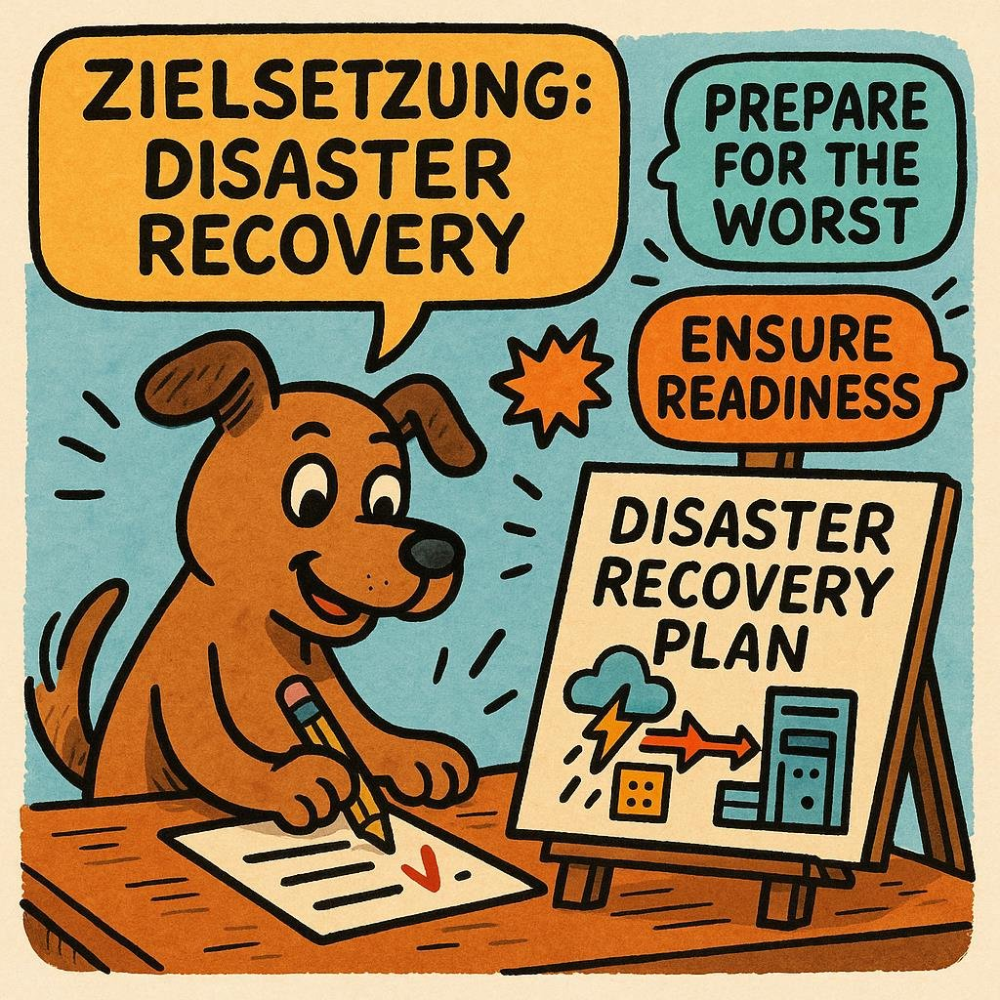{fig-alt="Comic-Hund plant Disaster Recovery: Prepare for the worst"}
:::
:::

## Warum Backups unverzichtbar sind

::: columns
::: {.column width="56%"}
- Ransomware – greift gezielt Backup-Repositories, Snapshots und Backup-Admins an
- Insider-Angriffe
- Hardware-Ausfälle
- Menschliche Fehler

Backups sind die letzte Verteidigungslinie – sie müssen **manipulationssicher, isoliert und wiederherstellbar** sein.
:::
::: {.column width="40%"}
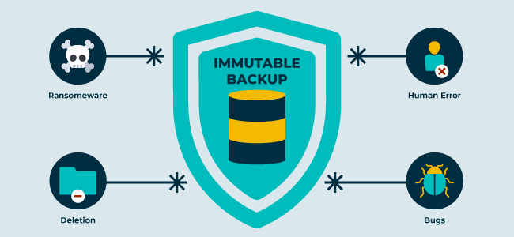{fig-alt="Schild Immutable Backup gegen Ransomware, Löschung, Fehler und Bugs"}
:::
:::

## Backup vs. Archiv vs. Redundanz

::: columns
::: {.column width="56%"}
- **Backup = Wiederherstellung** vergangener Zustände
- **Archiv = Langzeit**-Aufbewahrung und Compliance (WORM)
- **Redundanz = Hochverfügbarkeit** im laufenden Betrieb

Redundanz löst keine logischen Probleme – sie spiegelt Fehler oft nur schneller.

„Wir haben RAID, also haben wir Backups.“ · „Snapshots sind doch Backups.“ – beides falsch.
:::
::: {.column width="40%"}
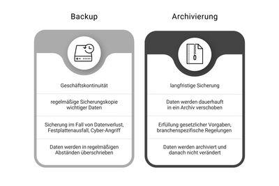{fig-alt="Gegenüberstellung Backup und Archivierung"}
:::
:::

## 3-2-1-1-0-Regel

::: columns
::: {.column width="56%"}
- **3** Kopien
- **2** Medientypen
- **1** Offsite
- **+1** Immutable / Air-Gap
- **+0** fehlerfreier Restore

Ein Backup ist nur dann ein Backup, wenn der Restore erfolgreich getestet wurde.
:::
::: {.column width="40%"}
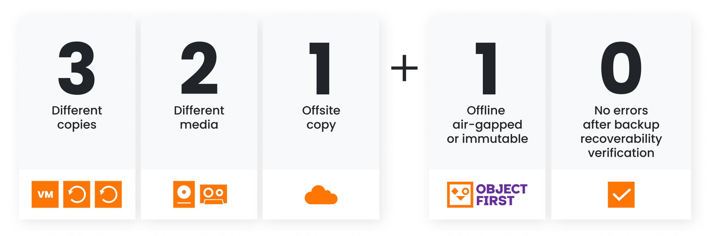{fig-alt="Grafik der 3-2-1-1-0-Regel"}
:::
:::

## Backup-Typen

::: columns
::: {.column width="56%"}
- **Vollbackup** – vollständig, schneller Restore, hoher Speicherbedarf
- **Inkrementell** – Änderungen seit dem letzten Backup; schnell, aber Restore braucht die ganze Kette
- **Differenziell** – Änderungen seit dem letzten Vollbackup; wächst mit der Zeit
- **Snapshots ≠ Backups** – hängen am Storage und sind bei dessen Schaden mitbetroffen

Robuste Strategien kombinieren risikobasiert.
:::
::: {.column width="40%"}
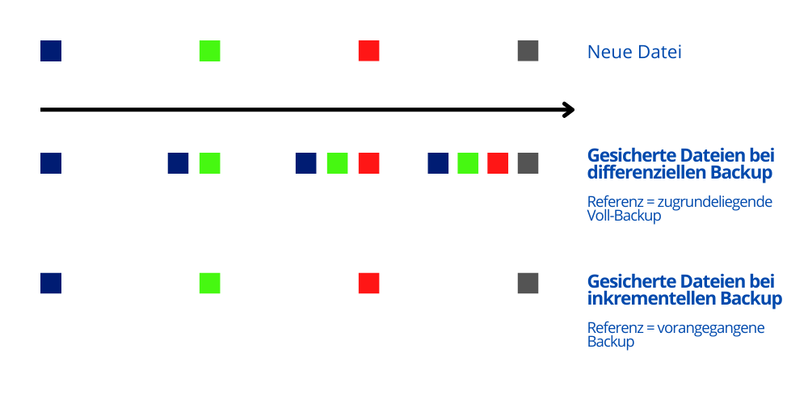{fig-alt="Zeitstrahl von Voll-, differenziellen und inkrementellen Backups"}
:::
:::

## Backup-Architekturen

::: columns
::: {.column width="56%"}
- **On-Prem** – volle Kontrolle, geringe Latenz; physische Risiken treffen alles zugleich
- **Cloud** – geografische Verteilung, einfache Offsite-Kopie; Anbieterabhängigkeit, Egress-Kosten, Shared Responsibility
- **Hybrid** – schneller lokaler Restore plus Cloud-Offsite; höhere Komplexität

Die Architektur passt zum Risiko – nicht umgekehrt.
:::
::: {.column width="40%"}
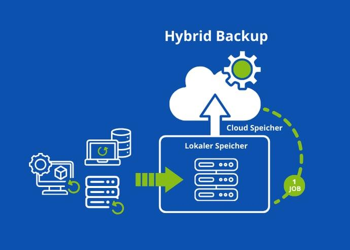{fig-alt="Hybrid-Backup: lokaler Speicher und Cloud-Speicher"}
:::
:::

## Air-Gapped & Immutable Backups

::: columns
::: {.column width="56%"}
- **Air-Gap:** physisch (Tape) oder logisch (zeitgesteuerter, kontrollierter Zugang) getrennt
- **Immutable:** unveränderbar (WORM), auch für kompromittierte Administratoren

Schützt gegen Löschaktionen, Ransomware und kompromittierte Admin-Konten.
:::
::: {.column width="40%"}
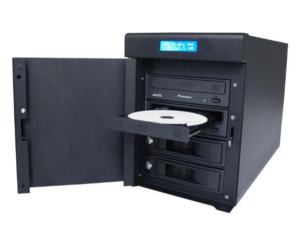{fig-alt="Bandlaufwerk als physisch getrenntes Backup-Medium"}
:::
:::

## Zero-Trust-Backup

::: columns
::: {.column width="56%"}
- MFA
- Segmentierung
- keine God-Admins – getrennte Administratorrollen, Least Privilege
- Backup-Server nicht im selben AD wie die Produktion
:::
::: {.column width="40%"}
{fig-alt="Turnbeutel mit Aufdruck Thank God for being an Admin"}
:::
:::

## Was ist DR?

::: columns
::: {.column width="56%"}
- **DR = Wiederherstellung** kompletter Systeme nach einem schweren Ereignis
- **BCM = Fortführung** der Geschäftsprozesse

DR ist der technische Motor von Business Continuity. Robustes BCM braucht funktionierendes DR.
:::
::: {.column width="40%"}
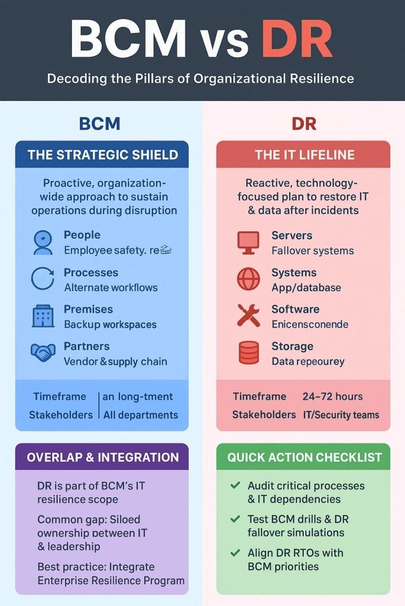{fig-alt="Gegenüberstellung BCM und DR"}
:::
:::

## RPO & RTO

::: columns
::: {.column width="56%"}
- **RPO: Datenverlust** – RPO 0 (keine Verluste), 15 min, 24 h
- **RTO: Wiederanlaufzeit** – RTO 0 (Active/Active), 4 h, 48 h

Beide bestimmen gemeinsam DR-Strategie, Kosten und Architekturkomplexität.
:::
::: {.column width="40%"}
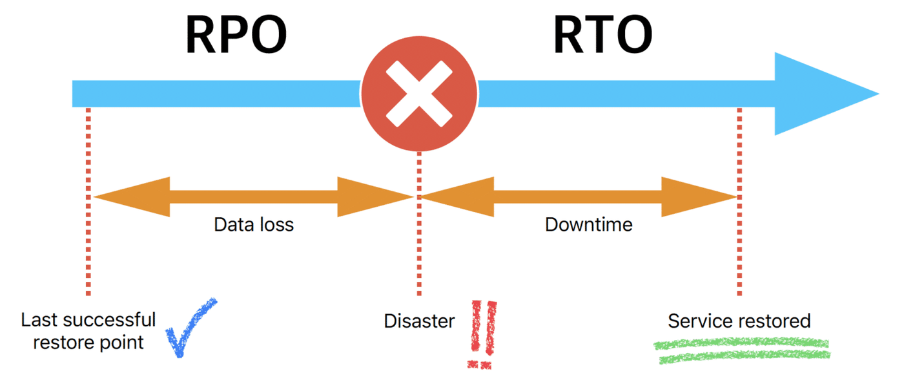{fig-alt="Zeitachse: RPO vor dem Ausfall, RTO bis zur Wiederherstellung"}
:::
:::

## DR-Strategien

::: columns
::: {.column width="56%"}
- Cold / Warm / Hot Standby
- Active/Passive
- Active/Active
- Multi-Cloud-DR

Je kürzer RTO und RPO, desto höher Kosten und Komplexität.
:::
::: {.column width="40%"}
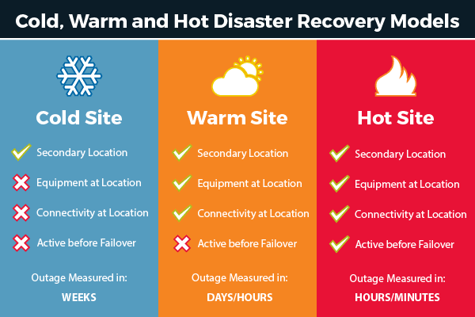{fig-alt="Cold, Warm und Hot Site im Vergleich"}
:::
:::

## Typische DR-Fehler

::: columns
::: {.column width="56%"}
- Restore funktioniert nicht
- Dokumentation fehlt oder ist veraltet
- Abhängigkeiten unbekannt – AD, DNS und IAM vor Applikationen, Storage vor VMs
- Unrealistische RTO/RPO (RTO 1 h bei täglichem Backup?)
- DR-Umgebung weicht von der Produktion ab
:::
::: {.column width="40%"}
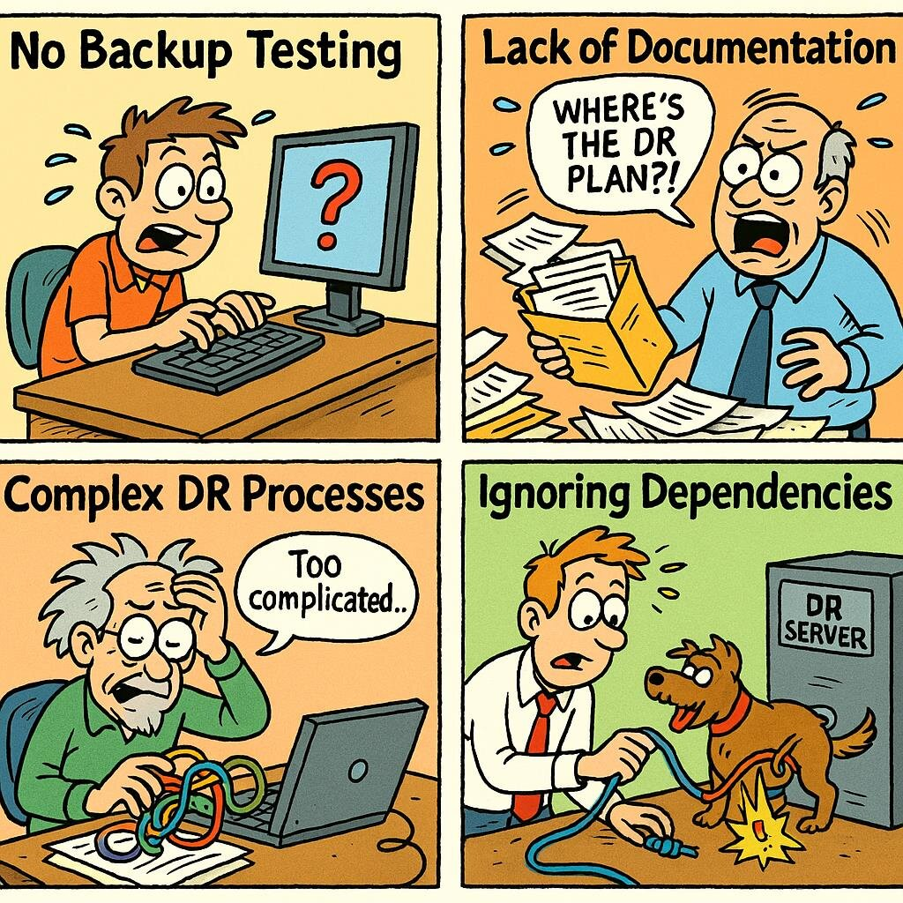{fig-alt="Comic-Panels: kein Backup-Test, fehlende Dokumentation, komplexe Prozesse, ignorierte Abhängigkeiten"}
:::
:::

## Notfalltests

::: columns
::: {.column width="56%"}
- **Tabletop** – Szenarien diskutieren, keine Systeme verändern
- **Dry Run** – einzelne Schritte, Restore einzelner Datenbanken oder VMs
- **Full Failover** – reale Umschaltung, RTO und RPO messen

Mindesterwartung: monatlicher Restore-Test, vierteljährlicher Tabletop, jährlicher Full Failover.
:::
::: {.column width="40%"}
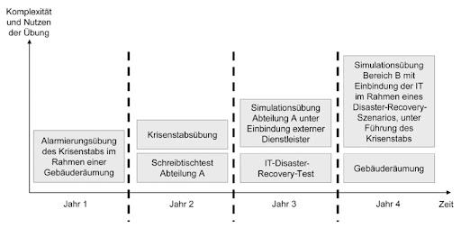{fig-alt="Mehrjahresplan: Übungen mit wachsender Komplexität"}
:::
:::

## Chaos Engineering

::: columns
::: {.column width="56%"}
- Fehler bewusst erzeugen: Systeme abschalten, Netzpfade unterbrechen, Storage-Ausfall simulieren
- Netflix Simian Army, Azure Chaos Studio, AWS Fault Injection Service
- Ziel: Schwachstellen unter realitätsnahen Bedingungen finden

Tests ohne Auswertung sind Übungen ohne Lerneffekt.
:::
::: {.column width="40%"}
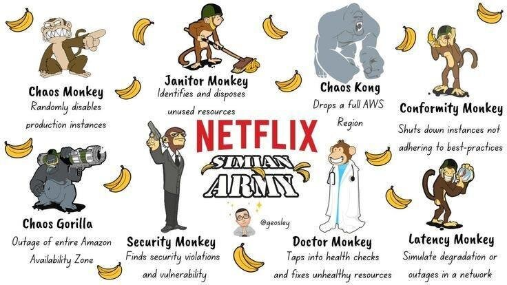{fig-alt="Netflix Simian Army: Chaos Monkey, Latency Monkey und weitere"}
:::
:::

## Übung: „Plan the Worst Day“

Resilienzteam des Hochschul-Rechenzentrums nach simuliertem Ransomware- und Datenbankkorruptionsvorfall. Systeme: Lernplattform, Identity/AD, E-Mail & Collaboration, Prüfungsdatenbank, Fileservices, Webseite/CMS.

1. **Backup-Konzept (30 min):** Daten, Frequenz, Typ, 3-2-1-1-0, Offsite, Ransomware-Schutz, Retention
2. **DR-Plan (30 min):** RTO/RPO, Strategie, Abhängigkeiten, Wiederherstellungsreihenfolge
3. **Notfalltest-Konzept (30 min):** Testarten, Häufigkeit, Metriken, Dokumentation, Lessons Learned

## Zusammenfassung & Ausblick

- Backups schützen
- DR stellt wieder her
- Tests verifizieren

Backups retten Daten. Disaster Recovery rettet Systeme. Tests retten den Betrieb.

**Nächste Woche:** Zero Trust, Microsegmentation, Cloud Resilience, Network Design

## Material

[Kapitel zum Termin](../../../termine/07.html) · [Glossar](../../../glossar.html) · [Quellen](../../../quellen.html)
