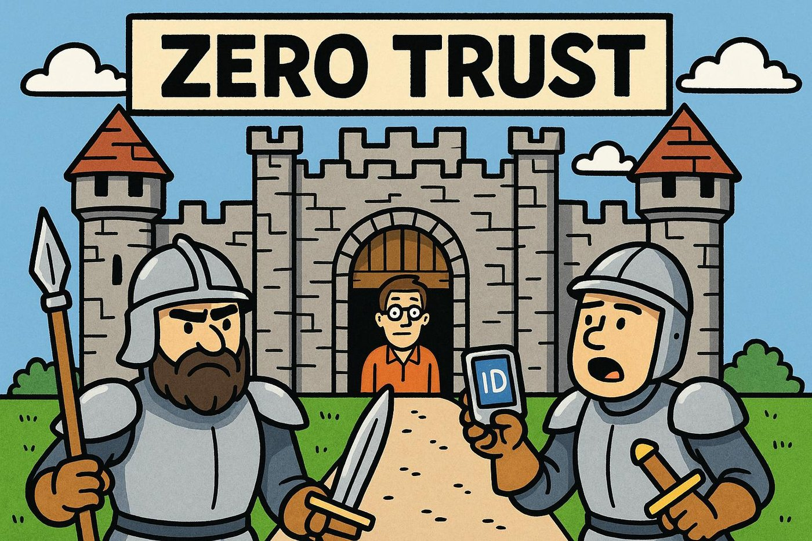
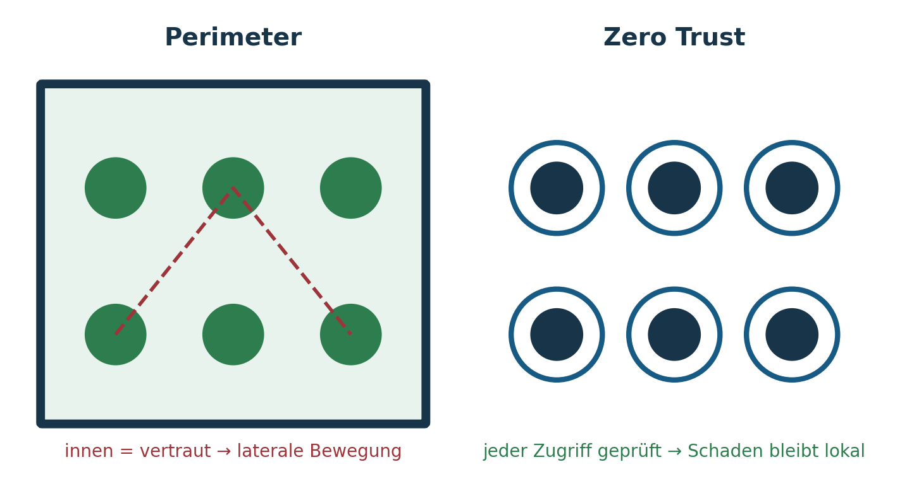
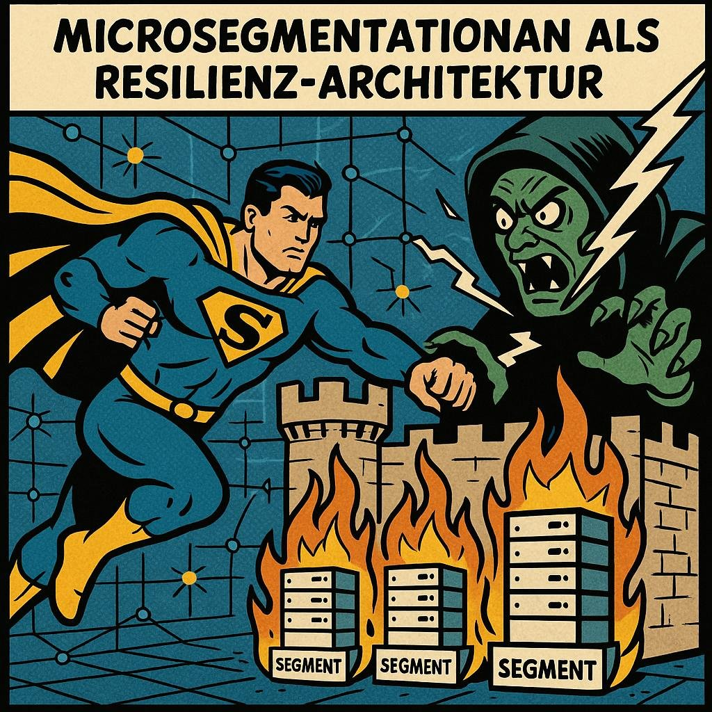
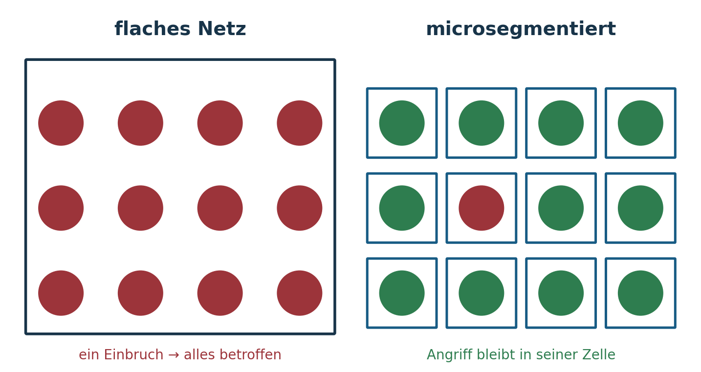
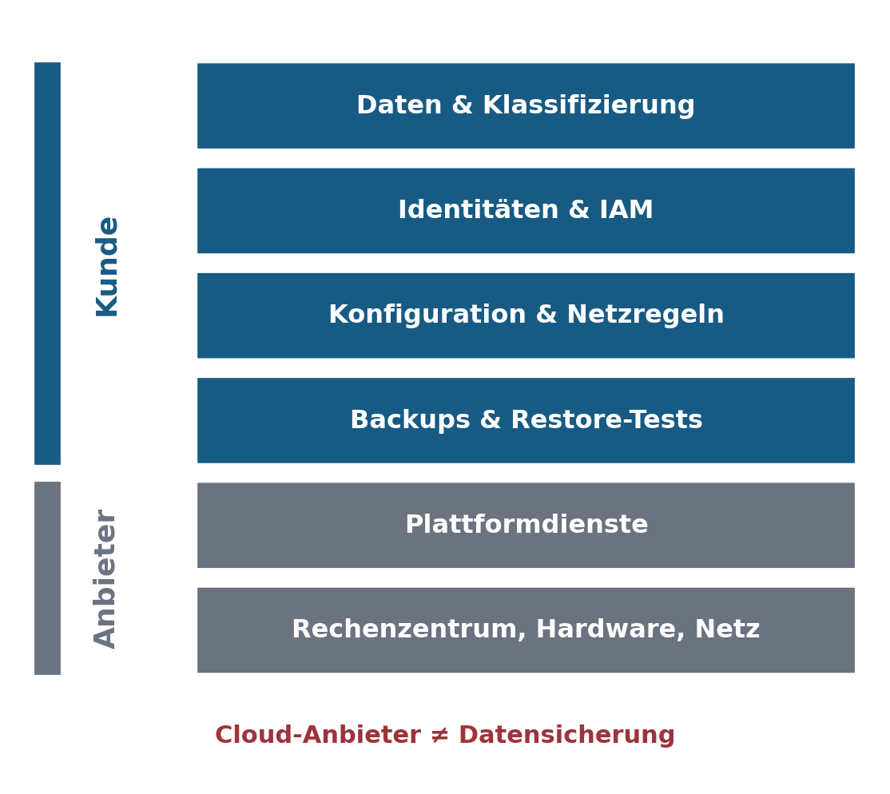
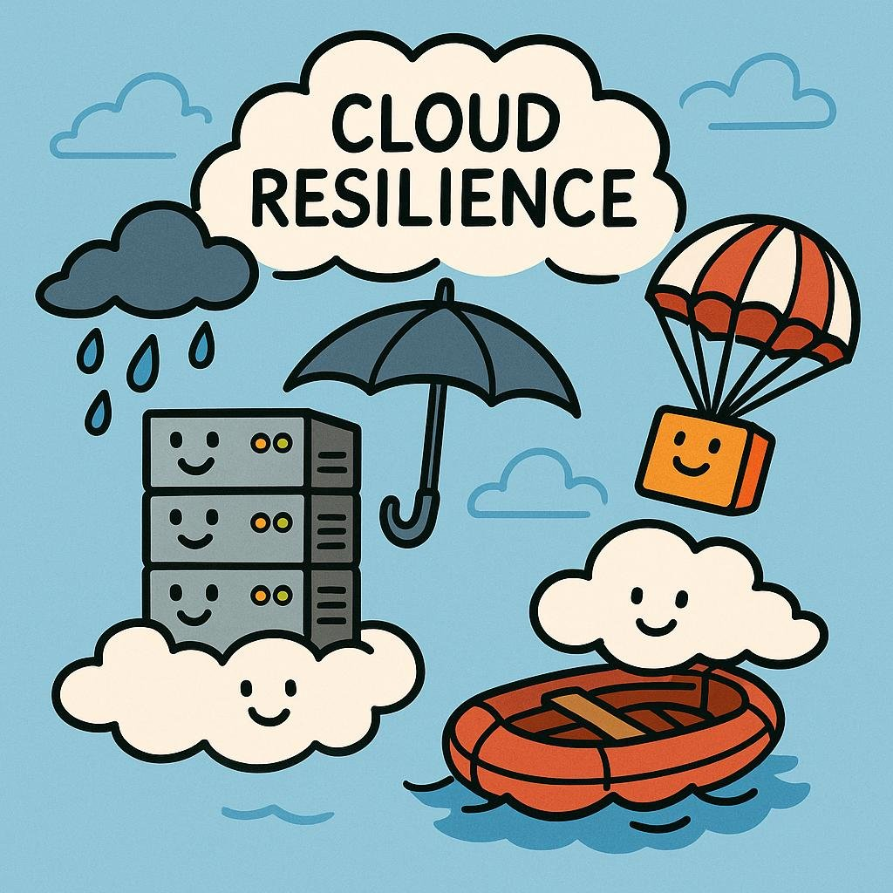
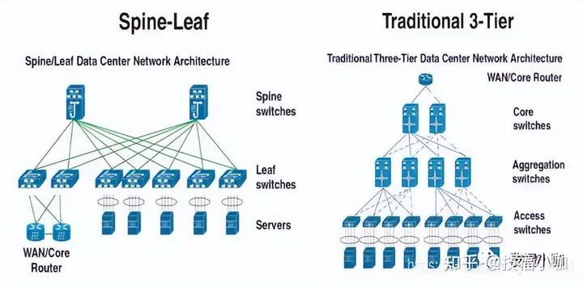
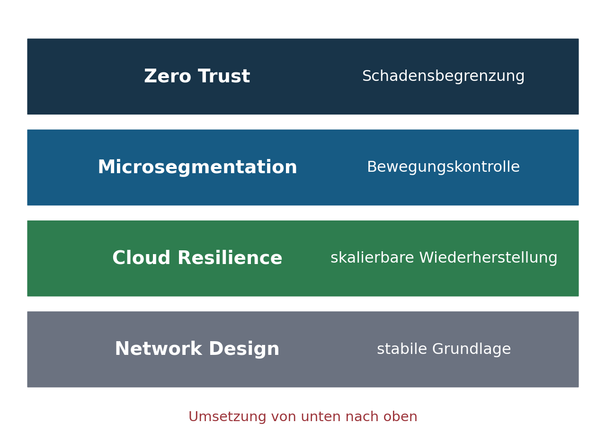

## Agenda

- Rückblick · Lernziele
- Zero Trust
- Microsegmentation
- Cloud Resilience
- Network Design
- Integration
- Übung (Gruppenarbeit)
- Zusammenfassung & Ausblick

## Rückblick & Einstieg

**Von Wiederherstellung zu Widerstandsfähigkeit**

- Resilienz ≠ nur Backups
- Architektur als Schutzmechanismus
- Fokus heute: präventive technische Resilienz – Schaden begrenzen, bevor er entsteht

## Lernziele der Sitzung

- Zero Trust verstehen & anwenden
- Laterale Bewegungen verhindern
- Cloud-Strukturen resilient gestalten
- Netzarchitektur als Resilienzinstrument nutzen

## Was ist Zero Trust?

::: columns
::: {.column width="56%"}
- „Never trust — always verify“
- Identität statt Netzwerkstandort
- Assume Breach

Der Perimeter existiert nicht mehr – Cloud, Homeoffice, SaaS und gestohlene Credentials haben ihn aufgelöst. Jeder Zugriff wird explizit, kontextabhängig und fortlaufend autorisiert.
:::
::: {.column width="40%"}
{fig-alt="Comic: Ritter vor der Burg prüft die Identität am Tor"}
:::
:::

## Säulen des Zero Trust

- Least Privilege
- MFA & starke Identitäten
- Continuous Authentication & Authorization
- Geräte- und Workload-Vertrauen (Patchstand, Integrität, Zertifikate)
- Datenflusskontrolle & Telemetrie

## Warum Zero Trust resilient macht

::: columns
::: {.column width="44%"}
- begrenzt Angriffsfläche
- verhindert Eskalation
- reduziert Kompromittierungsfolgen
- unterstützt schnelle Recovery

Zero Trust reduziert nicht die Wahrscheinlichkeit eines Angriffs, sondern die maximale Schadenswirkung. Zero Trust ist kein Produkt, sondern ein Architekturprinzip.
:::
::: {.column width="54%"}
{fig-alt="Perimeter mit vertrautem Innenraum gegenüber Zero Trust mit Prüfpunkt je Ressource"}
:::
:::

## Microsegmentation

::: columns
::: {.column width="56%"}
**Definition**

- Sicherheitszonen auf Workload-Ebene
- nicht nur VLANs oder Firewalls
- Software-defined statt physisch

Umsetzung netzwerk-, host- oder identitätsbasiert. Leitfrage: Wer muss wirklich miteinander kommunizieren?
:::
::: {.column width="40%"}
{fig-alt="Comic: Held hält Angreifer in abgeschotteten Segmenten fest"}
:::
:::

## Warum Microsegmentation?

::: columns
::: {.column width="44%"}
- stoppt laterale Bewegung
- klare Kommunikationspfade
- Angriffe bleiben lokal
- Forensik wird einfacher

Allow-List statt Block-List, Datenflussanalyse vor Enforcement, iterative Einführung. „Technologie segmentiert Systeme – aber nur Organisationen segmentieren Risiko.“
:::
::: {.column width="54%"}
{fig-alt="Flaches Netz komplett betroffen gegenüber segmentiertem Netz mit nur einer betroffenen Zelle"}
:::
:::

## Cloud Resilience

::: columns
::: {.column width="56%"}
**Shared Responsibility Model**

- Cloud-Anbieter ≠ Datensicherung
- Kunde verantwortet IAM, Konfiguration & Backups
- Resilienz muss bewusst gebaut werden
:::
::: {.column width="40%"}
{fig-alt="Shared Responsibility: Daten, IAM, Konfiguration und Backups beim Kunden, Infrastruktur beim Anbieter"}
:::
:::

## Cloud-Resilienzmaßnahmen

::: columns
::: {.column width="56%"}
- Multi-AZ / Multi-Region
- stateless Services
- Auto-Scaling & Load Balancing
- Immutable Infrastructure (IaC, Golden Images)
- Backups trotz Cloud, Observability, Chaos Engineering

„Cloud-Resilienz kommt aus Design — nicht aus einem Anbieterlogo.“
:::
::: {.column width="40%"}
{fig-alt="Comic: Wolken mit Schirm und Rettungsboot"}
:::
:::

## Network Design & Resilience

**Netzwerke als Resilienzfaktor**

- Single Points of Failure vermeiden – Redundanz nur mit Unabhängigkeit (zwei Carrier, zwei Stromphasen)
- DNS, Routing, IAM → kritisch
- Telemetrie & Monitoring als Pflicht

„Stabilität ohne Störung beweist nur Glück, nicht Resilienz.“

## Resiliente Design Patterns

::: columns
::: {.column width="56%"}
- Leaf-Spine statt klassischer Stern
- SD-WAN zur Dezentralisierung
- redundante Pfade & Carrier-Unabhängigkeit
:::
::: {.column width="40%"}
{fig-alt="Vergleich Leaf-Spine-Architektur und klassische Drei-Schichten-Architektur"}
:::
:::

## Integration

::: columns
::: {.column width="56%"}
**Zusammenspiel der Maßnahmen**

- Zero Trust = Schadensbegrenzung
- Microsegmentation = Bewegungskontrolle
- Cloud Resilience = skalierbare Wiederherstellung
- Network Design = stabile Grundlage

Reihenfolge: Netzwerkstabilität → Identität → Microsegmentation → Cloud-Resilienz → Zero Trust operationalisieren.
:::
::: {.column width="40%"}
{fig-alt="Vier Schichten: Zero Trust, Microsegmentation, Cloud Resilience, Network Design"}
:::
:::

## Übung: GameNova GmbH

Hybride Multiplayer-Plattform: Authentifizierung in AWS, Matchmaking im eigenen RZ, Managed-SQL-Datenbank, CDN-Frontend, Adminzugriff per VPN.

Vorfälle: gestohlene Admin-Credentials · Ransomware im Entwicklernetz · zwei Stunden Ausfall durch Routerdefekt · offener Storage-Bucket mit Telemetrie.

1. Zero Trust (20 P.) · 2. Microsegmentation (20 P.) · 3. Cloud Resilience (25 P.) · 4. Network Resilience (20 P.) · 5. Integration & Priorisierung (15 P.)

60–90 Minuten, Hilfsmittel erlaubt. Siehe Übungsblatt im Terminkapitel.

## Zusammenfassung

- Resilienz ist Architektur, nicht Backup.
- Vertrauen wird nicht vorausgesetzt.
- Angriffswege werden begrenzt.
- Architektur entscheidet über Krisenfähigkeit.

## Ausblick auf Sitzung 9

**Sonderthemen zu Resilienz**

- Gastvortrag aus der Praxis: Product & Production Security (OT)
- OT-Resilienz: Purdue-Modell, Safety – Security – Resilience
- KI-Resilienz: Bedrohungen, Prinzipien, Wallet DoS
- Übung Gandalf AI

## Material

[Kapitel zum Termin](../../../termine/08.html) · [Glossar](../../../glossar.html) · [Quellen](../../../quellen.html)
