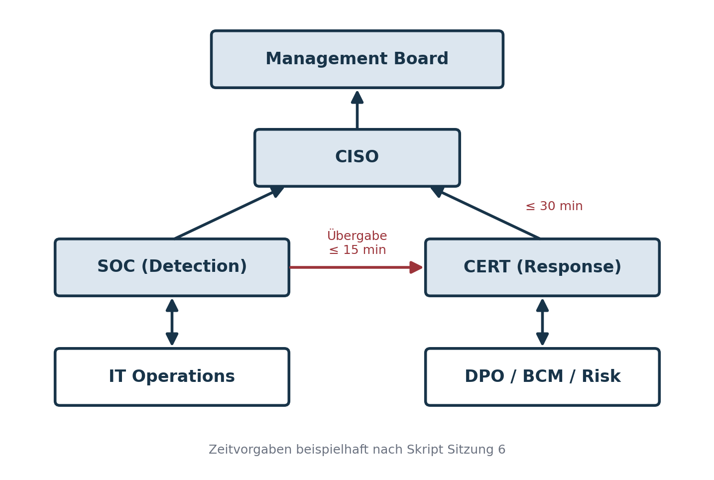

::: {.content-visible when-format="html"}
[Semesterübersicht](../index.html) · [Folien](../Präsentationen/Termin-06/_output/main.html) · [Skript](../skripte/Skript-06.html) ([PDF](../skripte/Skript-06.pdf), [Word](../skripte/Skript-06.docx)) · [Glossar](../glossar.html) · [Quellen](../quellen.html)
:::

# Leitfrage

> Wie wird aus Verantwortlichkeit Organisation – und aus Organisation Resilienz?

Resilienz bedeutet nicht, dass jeder alles kann, sondern dass jeder weiß, wann er in welcher Rolle handeln muss.

# Lernziele

Nach diesem Termin können Studierende

- die zentralen Rollen der Cyber-Resilienz (CISO, SOC, CERT, DPO, BCM, IT Operations, Management) und ihr Zusammenspiel erklären,
- Aufgaben, Befugnisse und Grenzen dieser Rollen analysieren,
- typische Konflikte und Governance-Lösungen erkennen,
- Rollenverantwortung und Eskalationslogik in einer Übung anwenden.

# Fachinhalte

## Rückblick

Kommunikation ist ein Schlüsselfaktor der Resilienz; Struktur und Verhalten sind zu unterscheiden; Rollenverständnis und Eskalationslogik tragen die Reaktion. „Resilienz ist Teamarbeit – aber nur, wenn das Team dieselbe Sprache spricht.“

## Rollen als Strukturprinzip

Rollen definieren Zuständigkeiten unabhängig von Personen und Hierarchie. Eine Rolle beschreibt **Verantwortung** (wofür bin ich zuständig?), **Befugnis** (was darf ich entscheiden?) und **Schnittstellen** (mit wem interagiere ich?).

- Technik kann reagieren – Menschen entscheiden.
- Klare Rollen verhindern Chaos und Doppelarbeit.
- Verantwortung ersetzt Schuld: Fehler werden als Prozessprobleme verstanden.
- Ohne Struktur keine Geschwindigkeit.

Typische Fragen, die vorab beantwortet sein müssen: Wer schaltet Systeme ab, wenn Malware erkannt wird? Wer informiert Behörden oder Kunden? Wer genehmigt öffentliche Kommunikation?

## CISO – Mandat und strategische Steuerung

Das Mandat ergibt sich in der Regel aus dem ISMS nach ISO/IEC 27001 [@iso27001]. Der CISO berichtet idealerweise direkt an Geschäftsführung oder Vorstand.

**Kernverantwortlichkeiten:** Sicherheitsstrategie entwickeln und pflegen; ISMS steuern und auditieren; Incident-Management-Prozess leiten und mit SOC/CERT koordinieren; Risiken an Management und Aufsicht kommunizieren; regulatorische Compliance (NIS-2, DSGVO, KRITIS) sicherstellen; Sicherheitskultur fördern.

**Mandatsdilemma:** Verantwortung ohne formale Entscheidungsgewalt oder Ressourcen („Accountability without Authority“). Lösung: strategische Verankerung, festes Budget und Reporting-Mandat, dokumentierte Eskalationsrechte. Eine zu tiefe Einbettung in die IT-Linie birgt Zielkonflikte zwischen Verfügbarkeit und Sicherheit.

Der CISO ist kein „Security-Polizist“, sondern Business-Partner: Er übersetzt technische Risiken in betriebswirtschaftliche Entscheidungsgrundlagen. „Ein CISO ohne Mandat ist wie ein Pilot ohne Steuerknüppel.“

## SOC – das sensorische Nervensystem

Das Security Operations Center überwacht Systeme, Netze und Anwendungen rund um die Uhr. Herzstück ist das SIEM, das Logdaten aggregiert und gegen Use Cases abgleicht.

**Aufgaben:** Monitoring & Detection, Analysis & Classification, Eskalation bestätigter Vorfälle an das CERT, Threat Intelligence, Reporting und Lagebilder.

| Ebene | Bezeichnung | Aufgabe |
|---|---|---|
| Tier 1 | Monitoring / Analysis | erste Alarmbewertung, Triage, Eskalation |
| Tier 2 | Investigation | vertiefte Analyse, Kontext, Angriffsketten |
| Tier 3 | Response / Forensics / Threat Hunting | technische Eindämmung, Spezialanalyse, proaktive Suche |

**Herausforderungen:** Alarm Fatigue, Personalmangel, fragmentierte Tool-Landschaft, unklare Übergaben, fehlende Priorisierung nach Business Impact. Antworten: Automatisierung (SOAR), klare Playbooks, Risikopriorisierung, kontinuierliches Training. „Resilienz beginnt mit Wahrnehmung – und Wahrnehmung beginnt im SOC.“

## CERT – die operative Reaktionseinheit

**Mandat:** Koordination der technischen Incident Response; Forensik und Ursachenanalyse; Containment und Eradication; Unterstützung des Wiederanlaufs; Kommunikation mit internen Stellen und externen Partnern (BSI, ENISA, Branchen-CERTs); Lessons-Learned-Dokumentation.

| Typ | Beschreibung | Beispiel |
|---|---|---|
| Internal CERT | eigenes Unternehmen oder Konzern | Corporate CERT |
| National CERT | staatliche Koordination | CERT-Bund |
| Sectoral CERT | branchenbezogene Zusammenarbeit | Finanz-, Energie-CERTs |
| Academic CERT | Forschung und Bildung | DFN-CERT |

Erfolgskriterien: klare Governance, trainierte Teams, standardisierte Playbooks, forensische Kompetenz, transparente Kommunikation, Nachbereitungskultur. „Das CERT ist das Immunsystem der Organisation – es reagiert, bekämpft, heilt und erinnert.“

## Zusammenspiel von CISO, SOC und CERT

| Funktion | Ebene | Hauptaufgabe | Zeithorizont |
|---|---|---|---|
| CISO | strategisch | Richtlinien, Ressourcen, Governance, Reporting | langfristig |
| SOC | operativ | Erkennen, Bewerten, Eskalieren | kurzfristig |
| CERT | taktisch | Koordinieren, Reagieren, Lernen | mittelfristig |

Prinzip: **Trennung der Funktionen – Integration der Wirkung.** Erfolgsfaktoren sind definierte Eskalationsschwellen, ein gemeinsames Lagebild (Single Source of Truth, etwa SIEM/SOAR, Lageberichte, Dashboards) und regelmäßige Lage- und Lessons-Learned-Meetings. „Was das SOC sieht, muss das CERT wissen – und was das CERT lernt, muss der CISO verstehen.“

## Weitere Schlüsselrollen

| Rolle | Kernaufgaben | Bezug zur Resilienz |
|---|---|---|
| DPO (Datenschutzbeauftragte Person) | DSGVO-Compliance, Bewertung von Datenschutzvorfällen, Schnittstelle zur Aufsicht | schützt Vertrauen und Reputation; bewertet Meldepflicht nach Art. 33 DSGVO |
| BCM-Manager | Business Impact Analysis, Notfallpläne, Wiederanlaufkoordination, Übungen | Recovery und Priorisierung: „Das CERT schützt Systeme – das BCM schützt den Zweck.“ |
| IT Operations Lead | Betrieb, Infrastruktur, Wiederherstellung nach CERT-Anweisung | technische Umsetzung; im Incident Betroffener und Akteur zugleich |
| Risk Manager | Risikoanalyse, Bewertung, Register | Früherkennung und Priorisierung |
| Management Board | Strategie genehmigen, Ressourcen, Risikoakzeptanz, externe Kommunikation | Gesamtverantwortung: Resilienz ist Chefsache |

Nach NIS-2-Richtlinie [@nis2] und ISO/IEC 27001 muss die Leitung nachweislich Verantwortung für Sicherheits- und Resilienzmaßnahmen übernehmen.

## Kommunikations- und Eskalationsmodell

Grundprinzipien resilienter Kommunikation: **Klarheit** (wer informiert wen, über welchen Kanal, mit welchem Ziel?), **Redundanz** (mehr als ein Pfad), **Priorisierung** nach Schweregrad, **Vertraulichkeit** (Need-to-know), **Bidirektionalität** (jede Information erzeugt eine Rückmeldung). Weitere Leitsätze: Single Source of Truth, Time to Inform innerhalb definierter Fristen, vorab definierte und getestete Kanäle.

{fig-alt="Organigramm: Das Management Board steht oben, darunter der CISO. SOC (Detection) und CERT (Response) berichten an den CISO; das SOC übergibt an das CERT innerhalb von 15 Minuten, das CERT eskaliert an den CISO innerhalb von 30 Minuten. Darunter IT Operations sowie DPO, BCM und Risk." width=80%}

Ebenen: operativ (SOC, IT Ops – technische Meldungen), taktisch (CERT, DPO, BCM – Koordination und Priorisierung), strategisch (CISO, Management – Entscheidungen, Ressourcen, externe Kommunikation). Die Eskalationszeiten sind Beispielwerte aus dem Skript.

**Kanäle:** Krisenkanäle (z. B. Teams-„Crisis Room“), Hotlines und War Rooms, automatisierte Alarmierung aus SIEM/SOAR, Incident-Management-Tools und **Offline-Fallbacks** bei Netzausfall (Mobiltelefone, SMS). Cyber-Resilienz ohne Kommunikationsresilienz bleibt Illusion.

## Meldepflichten

| Kategorie | Meldepflicht | Ansprechpartner |
|---|---|---|
| technischer Sicherheitsvorfall | nein | CERT, CISO |
| datenschutzrelevanter Vorfall | ja – binnen 72 Stunden (Art. 33 DSGVO) | DPO |
| kritische Infrastruktur / NIS-2-Einrichtung betroffen | ja – Frühwarnung, Meldung und Abschlussbericht (NIS-2, BSIG) | CISO, Management |
| Betriebsunterbrechung über definierte Dauer | BCM-relevant | BCM-Manager |

„Nicht jeder Incident ist meldepflichtig – aber jeder muss dokumentiert werden.“

::: {.callout-note title="Hinweis zur Aktualität"}
Das Skript verweist auf § 8b BSIG. Mit dem NIS-2-Umsetzungsgesetz ist das BSIG seit Dezember 2025 neu gefasst; die Paragraphenangaben sind vor Verwendung zu prüfen. Die NIS-2-Richtlinie ist die Richtlinie (EU) 2022/2555. Siehe [Hinweise zur Aktualität](../quellen.html#hinweise-zur-aktualität).
:::

## Konfliktlinien und Lösungsprinzipien

Jede Rolle optimiert ein anderes Kriterium: der CISO Risiko, das SOC Detektionsgeschwindigkeit, das CERT Eindämmung, IT Ops Verfügbarkeit, der DPO Rechtssicherheit, das Management Geschäftskontinuität und Kosten.

| Konflikt | Ursache | Resiliente Lösung |
|---|---|---|
| CISO vs. CIO | Sicherheit vs. Verfügbarkeit | klare Zieltrennung, gemeinsame KPIs |
| SOC vs. IT Ops | „Wer darf eingreifen?“ | Runbooks und Eskalationskriterien |
| CERT vs. PR | Kommunikationsfreigabe | vorab definierte Kommunikationsmatrix |
| BCM vs. Security | Wiederanlauf vs. Beweissicherung | Business-Impact-Analysen abstimmen |
| DPO vs. Incident Team | Datenschutzmeldungen, Datenweitergabe | Abstimmung mit Legal und CISO |

Lösungsprinzipien: Governance durch Klarheit, Kommunikation durch Standardisierung, Entscheidung durch Vorbereitung (Tabletop), Priorisierung durch Business Impact, Vertrauen durch Kultur. Beispielhafte Governance-Matrix:

| Entscheidungsfeld | Primär verantwortlich | Stellvertretend | Informationspflicht |
|---|---|---|---|
| Isolierung eines Systems | CERT | IT Ops | CISO |
| Externe Kommunikation | Management | PR | CISO, DPO |
| Behördenmeldung | DPO | CISO | Management |
| Wiederanlaufentscheidung | BCM | CERT | Management |
| Lessons Learned | CISO | CERT | alle betroffenen Bereiche |

„Reibungslosigkeit ist kein Zeichen von Stabilität, sondern von Stillstand.“ Cross-Role-Trainings machen Reibung vorhersehbar.

# Normativer Bezug

| Standard / Leitlinie | Relevanz |
|---|---|
| ISO/IEC 27001 | Rollen und Verantwortlichkeiten im ISMS |
| ISO/IEC 27035 | Incident-Response-Prozesse und Eskalationspfade |
| ISO 22320 | Krisenmanagement und Führungsstrukturen |
| ISO 22316 | Grundprinzipien organisationaler Resilienz |
| BSI-Standard 200-4 | Business Continuity Management |
| ENISA Good Practice | SOC/CERT-Zusammenarbeit |
| NIS-2-Richtlinie (EU) 2022/2555 | Verantwortung der Leitung, Meldepflichten |

# Übung: Wer macht was im Incident?

Montag, 08:47 Uhr: Eine Person im Finanzbereich öffnet eine E-Mail mit dem Betreff „Überweisungserlaubnis“. Minuten später meldet das SOC verdächtige Logins aus dem Ausland mit kompromittierten Admin-Credentials. Das CERT wird informiert; ob Daten abgeflossen sind, ist unklar. Das Management fordert einen Bericht, der DPO fragt nach der Meldepflicht, und die Presseabteilung hat Gerüchte über einen Cyberangriff gehört.

Gruppen mit 4–5 Personen, 20 Minuten, danach 15 Minuten Plenum:

1. Identifizieren Sie alle relevanten Rollen.
2. Ordnen Sie zu: Wer wird zuerst informiert? Wer entscheidet über Systemtrennung? Wer kommuniziert intern und extern? Wer bewertet rechtliche Meldepflichten? Wer dokumentiert und berichtet an das Management?
3. Skizzieren Sie ein Kommunikationsmodell mit Pfeilen zwischen den Rollen.
4. Definieren Sie einen Eskalationszeitplan (SOC → CERT → CISO innerhalb von x Minuten).
5. Benennen Sie Konfliktpunkte und schlagen Sie Governance- oder Prozessverbesserungen vor.

Merksatz: **Klarheit schafft Geschwindigkeit – und Geschwindigkeit schafft Resilienz.**

Reflexion im Plenum: Wo entstanden Unklarheiten? Welche Wege waren zu lang? Welche Rolle hätte stärker eingebunden werden müssen? Wie hätte psychologische Sicherheit geholfen?

# Prüfungsrelevante Leitfragen

Die Leitfragen 1–30 des Skripts bilden die Klausurbasis, 31–40 dienen der Vertiefung. Eine Auswahl:

1. Warum sind klar definierte Rollen eine zentrale Voraussetzung organisationaler Resilienz?
2. Wie unterscheidet sich Verantwortung von Schuld im Kontext der Cyber-Resilienz?
3. Welche Kernaufgaben und Befugnisse hat der CISO? Was bedeutet das Mandatsdilemma?
4. Warum sollte der CISO unabhängig von der IT-Linie positioniert sein?
5. Wie ist ein SOC nach dem Tier-Modell aufgebaut? Was ist Alarm Fatigue?
6. Welche Unterschiede bestehen zwischen Internal, Sectoral und National CERTs?
7. Was bedeutet „Trennung der Funktionen – Integration der Wirkung“?
8. Warum ist ein gemeinsames Lagebild essenziell?
9. Welche Rolle spielt der DPO im Incident-Fall? Wie ergänzen sich CERT und BCM im Wiederanlauf?
10. Warum trägt das Management Board die Gesamtverantwortung?
11. Nennen Sie die fünf Grundprinzipien resilienter Kommunikation.
12. Welche Meldepflichten ergeben sich aus DSGVO und NIS-2?
13. Nennen Sie drei typische Konfliktlinien und wie eine Governance-Matrix hilft.
14. Transfer: Was unterscheidet eine resiliente von einer robusten Organisation aus Sicht der Verantwortlichkeitsstruktur?

**Zusammenfassung:** Rollen sind das organisatorische Immunsystem der Cyber-Resilienz. CISO, SOC und CERT bilden das Kern-Trio, unterstützt von DPO, BCM, IT Ops und Management. Klare Zuständigkeiten, getestete Eskalationswege und abgestimmte Kommunikation sind Resilienz in Aktion. „Struktur ist das Skelett der Resilienz – Kommunikation ist ihr Nervensystem.“

# Vor- und Nachbereitung

**Ausblick Termin 7:** Technische Resilienzmaßnahmen I – Backup, Disaster Recovery und Notfalltests.

# Material aus dem Archiv

Das vollständige Vorlesungsskript zu dieser Sitzung steht unter [Skript 6](../skripte/Skript-06.html), auch als [PDF](../skripte/Skript-06.pdf) und [Word-Datei](../skripte/Skript-06.docx).

`06 Org. Resilienz II - Rollen und Verantwortlichkeiten/06_Resilienz II Rollen und Verantwortlichkeiten.pdf` und `Skript Sitzung 6 Organisatorische Resilienz Rollen und Verantwortlichkeiten.pdf`.
