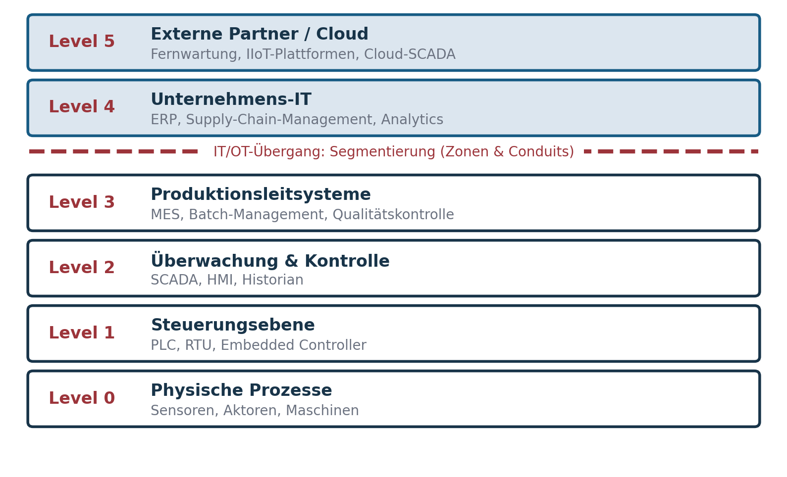

::: {.content-visible when-format="html"}
[Semesterübersicht](../index.html) · [Folien](../Präsentationen/Termin-09/_output/main.html) · [Skript](../skripte/Skript-09.html) ([PDF](../skripte/Skript-09.pdf), [Word](../skripte/Skript-09.docx)) · [Glossar](../glossar.html) · [Quellen](../quellen.html)
:::

# Leitfrage

> Was ändert sich an Resilienz, wenn Systeme physische Prozesse steuern – und wenn KI Entscheidungen vorbereitet?

# Lernziele

Nach diesem Termin können Studierende

- erklären, wie sich OT technisch und organisatorisch von IT unterscheidet und warum OT-Resilienz ein eigenes Fachgebiet ist,
- Risiken durch Cyberangriffe auf OT benennen und begründen, warum klassische IT-Security dort nicht ausreicht,
- das Purdue-Modell und das Zonen-Conduit-Prinzip zur Segmentierung anwenden,
- Bedrohungen für KI-Systeme und Prinzipien der KI-Resilienz erläutern,
- Human-in-the-Loop als Resilienzprinzip begründen.

# Gastvortrag: Product & Production Security (OT)

Thomas Gronenwald (KPMG) berichtet über „War Stories aus der Praxis“: Produktionsstillstände durch Cyberangriffe, die Entwicklung von getrennten zu vernetzten Produktionsnetzen und die Unterschiede zwischen IT und OT in Patch-, Change- und Sicherheitsmanagement. Die Vortragsfolien sind Material des Referenten und nicht Teil dieses Projekts. Die folgenden Inhalte stammen aus dem Vorlesungsskript.

# Fachinhalte OT-Resilienz

## Was ist OT?

Operational Technology umfasst Systeme, die physische Prozesse steuern, überwachen oder automatisieren: Produktionsanlagen, Energie- und Wasserversorgung, Verkehrsleitsysteme, chemische Anlagen, Medizintechnik, Gebäudeautomation, Logistik. IT verarbeitet Daten; OT bewegt Roboter, öffnet Ventile, schaltet Signale.

| | IT | OT |
|---|---|---|
| Ziel | Daten und Prozesse | physische Prozesse |
| Prioritäten | Confidentiality – Integrity – Availability | Safety – Availability – Integrity – Confidentiality |
| Lebensdauer | 3–5 Jahre | 10–30 Jahre |
| Wartungsfenster | häufig | selten |
| Sicherheitsphilosophie | „Patch early“ | „Change as little as possible“ |
| Echtzeit | Verzögerungen oft tolerierbar | Millisekunden zählen |

Ein Sicherheitsupdate, das eine Maschine sekundenlang stoppt, kann in einem Stahlwerk oder OP-Saal gefährlicher sein als eine bekannte Schwachstelle.

## Warum OT-Resilienz heute ein Top-Thema ist

- **Digitalisierung und Vernetzung:** Fernwartung, Kopplung mit IT-Netzen, Cloud-Integration, IIoT-Sensorik vergrößern die Angriffsfläche. Früher getrennte Netze (Air Gap) sind heute vernetzt, künftig bis in die gesamte Lieferkette.
- **Gezielte Angriffe:** Stuxnet, Triton/Trisis und Colonial Pipeline zeigen, dass physische Effekte in Kauf genommen oder angestrebt werden.
- **Verschränkung von Safety und Security:** Ein Cybervorfall kann Menschenleben, Umwelt und Versorgung gefährden.
- **Lieferketten:** proprietäre Firmware, eingeschränkte Updatefähigkeit, lange Supportzyklen.
- **Regulatorik:** KRITIS, NIS-2, IEC 62443 und ISO/IEC 27019 verlangen Maßnahmen zur OT-Resilienz.

## Der Dreiklang Safety – Security – Resilience

- **Safety** schützt Menschen und Umwelt vor Fehlfunktionen.
- **Security** schützt vor Cyberangriffen und Manipulation.
- **Resilience** ermöglicht Weiterarbeit oder schnelle Erholung.

Safety darf durch Security nicht gefährdet werden; Security darf die Verfügbarkeit nicht beeinträchtigen; Resilience gleicht unvermeidbare Störungen aus. OT-Resilienz bedeutet Schutz ohne Beeinträchtigung des physischen Betriebs.

## Architektur: das Purdue-Modell (ISA-95)

{fig-alt="Sechs gestapelte Ebenen: Level 5 externe Partner und Cloud, Level 4 Unternehmens-IT, darunter nach einer gestrichelten Linie für den IT/OT-Übergang Level 3 Produktionsleitsysteme, Level 2 Überwachung und Kontrolle, Level 1 Steuerungsebene und Level 0 physische Prozesse." width=85%}

Das Modell zeigt, wo Segmentierung notwendig ist, verdeutlicht Übergangsbereiche (Zonen und Conduits), hilft bei der Analyse von Angriffs- und Ausfallpfaden und strukturiert Notfall- und Wiederanlaufpläne.

**Kernkomponenten:** PLCs (Herz der Anlagensteuerung, echtzeitfähig, proprietäre Firmware); HMIs (oft Windows-basiert, daher malwareanfällig – falsche Anzeige heißt falsche Entscheidung); Sensorik und Aktorik (manipulierte Messwerte führen zu falscher Steuerlogik). Historische Protokolle wie Modbus, Profibus, DNP3 oder OPC Classic kennen weder Verschlüsselung noch Authentisierung. OT-Resilienz bedeutet oft: **Risiken managen, nicht eliminieren.**

## Bedrohungen und Angriffsvektoren

1. **Ransomware** trifft OT meist indirekt: Engineering-Workstations, HMIs oder MES/ERP werden verschlüsselt, die Anlage ist nicht kompromittiert, aber unbedienbar.
2. **Supply-Chain-Angriffe:** manipulierte PLC-Firmware, kompromittierte Wartungslaptops, Schadcode in Engineering-Software (Stuxnet).
3. **Remote Access und Wartungszugänge:** Modems mit Standardpasswörtern, gemeinsam genutzte Dienstleisterkonten, dauerhaft offene Tunnel.
4. **Manipulation von Steuerlogik und Parametern:** Angriffe auf Safety-Instrumented Systems wie bei Triton/Trisis sind die gefährlichste Kategorie.
5. **Physische Sabotage und Insider:** Insider kennen die Anlagenlogik und können Safety-Systeme umgehen.
6. **IT→OT-Pfadeffekt:** Phishing in der IT, laterale Bewegung, schlecht segmentierter Übergang, Zugriff auf Engineering-Workstations. Bei Colonial Pipeline (2021) begann der Angriff in der IT; das Management stoppte den OT-Betrieb vorsorglich.

## Rollen in der OT

IT-Sicherheit (CISO) fokussiert CIA, ISMS und IAM; OT-Security fokussiert Safety, Verfügbarkeit und Resilienz nach IEC 62443. Hinzu kommen Betrieb („Die Anlage muss laufen“), Instandhaltung, Engineering („ohne Zertifizierungen zu verlieren“) und Produktion („Stillstand kostet Geld“). Im Incident gilt: Die Anlage darf nicht einfach abgeschaltet werden, Safety hat Vorrang, SOC-Erkenntnisse müssen in Anlagensprache übersetzt werden, und der Wiederanlauf ist komplexer als die Wiederherstellung. Ein klassisches SOC „sieht“ OT oft nicht; ein OT-SOC braucht passive Netzüberwachung und OT-spezifische Signaturen.

## Resilienzmaßnahmen für OT

**Organisatorisch:** OT-spezifische Governance (keine ungeplanten Logikänderungen, definierte Patchfenster, Regeln für Fernwartung); klare Entscheidungswege (Wer darf eine PLC umprogrammieren? Wer entscheidet über einen Anlagenstopp?); konservatives Change-Management mit Rollback; vollständiges Asset-Inventar; Awareness-Training für OT-Personal.

**Technisch:** Segmentierung nach Zonen und Conduits (IEC 62443); Jump Hosts mit MFA, zeitlich begrenzten Wartungsfenstern und Session-Recording statt dauerhafter VPN-Tunnel; passives Monitoring mit Deep Packet Inspection und Integritätsprüfung von PLC-Programmen; Patch-Management nach Test und Risikoabwägung mit kompensierenden Maßnahmen; Offline-, versionierte und getestete Backups von PLC-Programmen, SCADA-, HMI-, Netz- und Safety-Konfigurationen; redundante Steuerungen und Hot-Standby.

**Safety und Security integrieren:** gemeinsames Risikomanagement; HAZOP kombiniert mit Cyber Threat Modeling; Safety Integrity Levels (SIL) und Security Levels (SL nach IEC 62443) gemeinsam betrachten; eine Kommunikationskultur zwischen IT, OT und Safety.

## Notfallmanagement und Wiederanlauf

Ein ungeplanter Shutdown kann gefährlicher sein als der Weiterbetrieb: Pumpen dürfen nicht abrupt stoppen, Druck muss kontrolliert abgebaut, chemische Prozesse müssen geordnet auslaufen. Das Wiedereinschalten ist oft gefährlicher als das Abschalten. OT-Incident-Response: Erkennen und Alarmieren → Triage (Safety-Auswirkung?) → Stabilisierung in einen sicheren Zustand → passive Forensik ohne Neustarts ohne Engineering-Freigabe → Kommunikation (Anlagenfahrer, Produktion, Safety, Management, ggf. Behörden) → Wiederherstellung und Wiederanlauf.

| Wiederanlauf | Merkmale |
|---|---|
| Cold Start | vollständiger Neustart, hohes Risiko, nur bei stehenden Prozessen |
| Warm Start | Teilneustart mit Erhalt von Prozesszuständen, geringeres Risiko |
| Hot Start / Failover | redundante Steuerung übernimmt automatisch, geringste Ausfallzeit, regelmäßig zu testen |

## Normen für OT-Resilienz

| Referenz | Beitrag |
|---|---|
| IEC 62443 [@iec62443] | OT-„Goldstandard“: Defense-in-Depth, Zonen & Conduits, Security Levels 1–4, Rollen für Hersteller, Integratoren und Betreiber |
| NIST CSF und NIST SP 800-82 [@nistcsf2; @nist80082r3] | Strukturierung auf Managementebene, praxisnahe ICS-/OT-Leitlinien |
| BSI ICS-Security-Kompendium, BSI 200-4 | OT-Komponenten, Angriffsvektoren, Maßnahmenkatalog; Notfall- und Wiederanlaufmanagement |
| ENISA | europäische Perspektive, NIS-2-Umsetzung, kritische Infrastrukturen |
| ISO/IEC 27019 [@iso27019] | energiespezifische Ergänzung zu ISO/IEC 27002 |

Sinnvolle Kombination: ISO 27001 oder Grundschutz für das Managementsystem, IEC 62443 für die technische OT-Umsetzung, NIST und ENISA für Methoden, BSI 200-4 für Notfall- und Wiederanlaufmanagement.

# Fachinhalte KI-Resilienz

## Warum Resilienz auch für KI wichtig ist

KI verändert Geschäftsprozesse, schafft aber neue Abhängigkeiten. Wenn ein Chatbot plötzlich falsche Antworten gibt oder ein Modell durch fehlerhafte Daten beeinflusst wird, reicht ein Neustart nicht aus. KI-Resilienz ist die Fähigkeit einer Organisation, solche Störungen zu erkennen, abzuschwächen und daraus zu lernen – technisch und organisatorisch [@loomans2025kiresilienz].

## Bedrohungen für KI-Systeme

- **Daten-Poisoning** – Manipulation von Trainingsdaten; verzerrt die gesamte Entscheidungslogik.
- **Prompt-Poisoning** – manipulierte Eingaben bewegen generative Modelle zu unerwünschtem Verhalten.
- **Bias und Fairness-Probleme** – systematische Verzerrung durch einseitige Daten. Im Artikelentwurf als Akronym: **B**uilt-in, **I**nsensitivity to relevant differences, **A**ssumptions encoded in data or rules, **S**ystematic skew.
- **Verfügbarkeitsangriffe** – DDoS auf rechenintensive KI-Dienste.
- **Model Drift** – schleichende Veränderung der Datenmuster.
- **Wallet DoS** – Angriffe, die durch übermäßige API-Nutzung Credits oder Guthaben aufbrauchen.

## Prinzipien der KI-Resilienz

Bekannte Prinzipien in neuem Umfeld:

- **Verifikation und Validierung** der Trainingsdaten und Modelle
- **Redundanz und Diversität** – verschiedene Modelle, Anbieter und Datenquellen; Abweichungen als Signal nutzen
- **Transparenz** – nachvollziehbare Entscheidungswege
- **Adversarial Testing und Stresstests** – gezielte Angriffe und Extremfälle simulieren
- **Kontinuierliches Monitoring** – über technische Metriken hinaus: Genauigkeit, Stabilität, Bias, Sicherheit, ethische Kriterien
- **Recovery** – Modelle kontrolliert auf einen definierten Zustand zurücksetzen, reproduzierbares Training
- **Bias-Reduktion**
- **Human in the Loop** – der Mensch bleibt Teil der Entscheidung

Organisatorisch: Schulung und Bewusstsein, Governance mit Rollen wie AI Owner oder Model Risk Officer, „kontrollierter Kontrollverlust“ im Umgang mit unerwartetem Verhalten, Graceful Degradation und systematisches Lernen aus Vorfällen. „Resilienz ist die neue Vertrauenswährung der KI-Welt.“

## Fallbeispiel Daten-Poisoning

Wie kann ein Angreifer Trainingsdaten manipulieren? Absicherung durch Datenvalidierung, robuste Algorithmen und regelmäßige Audits. OT-Beispiel aus dem Skript: Manipulierte Vibrationsdaten führen dazu, dass die KI keinen Lagerschaden erkennt – bis zum Totalausfall.

## Wallet DoS

Ein Angriff, bei dem übermäßige API-Nutzung das Guthaben eines Dienstanbieters aufbraucht – technischer und finanzieller Schaden. Gegenmaßnahmen: mandantenspezifische API-Schlüssel, Rate Limits und Monitoring pro Mandant, separate Budgetgrenzen pro Mandant.

## Reifegrad der KI-Governance

Die Zusammenfassungsfolie („Baby-Ansatz“) zeigt fünf Reifestufen: (1) Ad-hoc-Governance, (2) grundlegende Strukturen und Prozesse etablieren, (3) über die Grundlagen hinausgehen, (4) erweitern und reifen, (5) eingebettete und einflussreiche Governance.

## KI in OT

Einsatzfelder: Predictive Maintenance, Anomalieerkennung, Qualitätskontrolle, Energie- und Prozessoptimierung. KI kann als Frühwarnsystem die Resilienz stärken, schafft aber neue Risiken: Modellfehler bei seltenen Szenarien, Daten-Poisoning, intransparente Black-Box-Modelle von Dritten, Abhängigkeit von Cloud und API-Budgets. Leitplanken: Human-in-the-Loop, Erklärbarkeit, Plausibilitätsprüfung gegen klassische Verfahren, Überwachung von Model Drift und **klare Trennung von Safety-Systemen** – KI darf Not-Aus und Safety-Logik weder ersetzen noch deaktivieren.

# Übungen

## Gandalf AI

Versuchen Sie unter [gandalf.lakera.ai](https://gandalf.lakera.ai), einem Sprachmodell über mehrere Level hinweg ein geschütztes Passwort zu entlocken. Welche Abwehrmechanismen erkennen Sie? Was bedeutet das für Prompt-Poisoning und für die Resilienz von KI-Anwendungen?

## Fallstudien aus dem Skript (Auswahl)

- **Cyberangriff auf ein SCADA-System:** verzögerte Rückmeldungen, inkonsistente Sensorwerte, ungewöhnliche HMI-Anzeigen. Mögliche Ursachen? Einordnung ins Purdue-Modell? Bedrohungsvektoren? Erste Maßnahmen? Einzubindende Rollen?
- **Triton/Trisis:** Was unterscheidet den Angriff von klassischer Malware? Welche Rolle spielt Safety? Welche Resilienzmaßnahmen hätten den Schaden begrenzt?
- **Rollenspiel CISO vs. Produktionsleitung:** Der CISO fordert sofortige Segmentierung, Abschaltung eines Fernwartungszugangs und Notfall-Patching; die Produktionsleitung warnt vor Ausfall und Vertragsstrafen. Rollen: CISO, Produktionsleitung, OT-Engineer, Safety-Beauftragte. Ziel ist eine gemeinsame Entscheidung.
- **Zone-Conduit-Modell:** Zonen nach IEC 62443 definieren, Conduits festlegen, kritische Übergänge identifizieren, Schutzmaßnahmen pro Zone benennen.
- **OT-Wiederanlaufplan:** Reihenfolge, Rollen, Sicherheitsprüfungen, Kriterien für Cold, Warm oder Hot Start.
- **KI-Resilienz in OT:** Resilienzgewinne, neue Risiken, Umsetzung von Human-in-the-Loop, nicht zu überschreitende Safety-Grenzen.

# Prüfungsrelevante Leitfragen

1. Was ist OT, und wodurch unterscheidet sie sich grundlegend von IT?
2. Warum reicht klassische IT-Security für OT nicht aus?
3. Erläutern Sie den Dreiklang Safety – Security – Resilience. Nennen Sie ein Beispiel, bei dem eine Security-Maßnahme die Safety gefährdet.
4. Beschreiben Sie das Purdue-Modell und seine Bedeutung für die Segmentierung.
5. Warum wirkt sich IT-Ransomware häufig auch auf OT aus?
6. Warum sind Remote-Wartungszugänge besonders kritisch?
7. Warum ist ein ungeplanter Shutdown in OT oft gefährlicher als der Weiterbetrieb? Unterscheiden Sie Cold, Warm und Hot Start.
8. Warum ist IEC 62443 der zentrale OT-Standard, und wie unterscheidet sie sich von ISO 27001?
9. Nennen Sie Bedrohungen für KI-Systeme. Was ist Daten-Poisoning?
10. Was ist Wallet DoS, und welche Gegenmaßnahmen gibt es?
11. Warum ist Human-in-the-Loop ein zentrales Resilienzprinzip, und warum darf KI keine Safety-Systeme ersetzen?

Für die Klausur gilt: Entscheidend ist nicht das Aufzählen von Maßnahmen, sondern Begründung, Einordnung und Abwägung von Zielkonflikten zwischen Safety, Security, Verfügbarkeit und Wirtschaftlichkeit.

# Vor- und Nachbereitung

Kontrollfragen zum Artikelentwurf KI-Resilienz: Welche besonderen Bedrohungen gibt es? Welche Prinzipien machen KI-Systeme resilienter? Wie sähe ein Fallbeispiel aus dem Gaming-Bereich aus (etwa Manipulation eines Anti-Cheat-Systems)? Was bedeutet es, KI-Modelle auf ethische Grundsätze auszurichten? Wie lassen sich die Prinzipien in realen Projekten anwenden?

**Ausblick Termin 10:** Resilienz der Zukunft – Quantencomputing, autonome Systeme, Gesellschaft und Ethik.

::: {.callout-note title="Hinweis zur Aktualität"}
Das NIST CSF 2.0 hat sechs statt fünf Kernfunktionen; NIST SP 800-82 trägt seit Revision 3 den Titel „Guide to Operational Technology (OT) Security“. Siehe [Hinweise zur Aktualität](../quellen.html#hinweise-zur-aktualität).
:::

# Material aus dem Archiv

Das vollständige Vorlesungsskript zu dieser Sitzung steht unter [Skript 9](../skripte/Skript-09.html), auch als [PDF](../skripte/Skript-09.pdf) und [Word-Datei](../skripte/Skript-09.docx).

`09 Sonderthemen/09_Sonderthemen.pdf`, `Skript 09 Sonderthemen OT und KI.pdf`, `KPMG_Klardenker_AI_Resilience_DRAFT HSM.pdf` (Artikelentwurf) und die Gastvortragsfolien (nicht übernommen).
